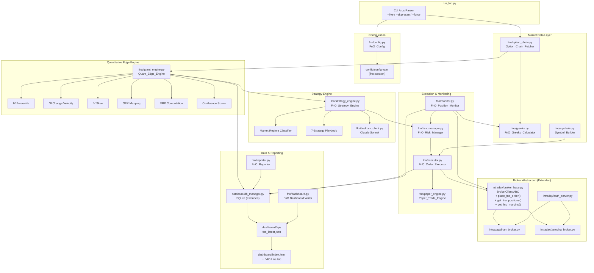
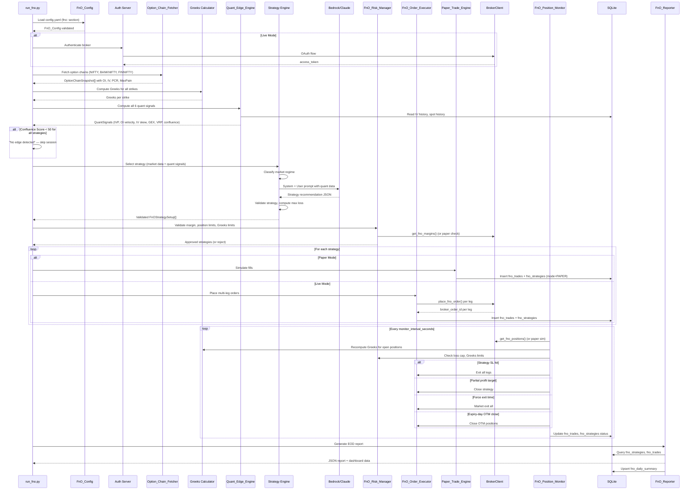
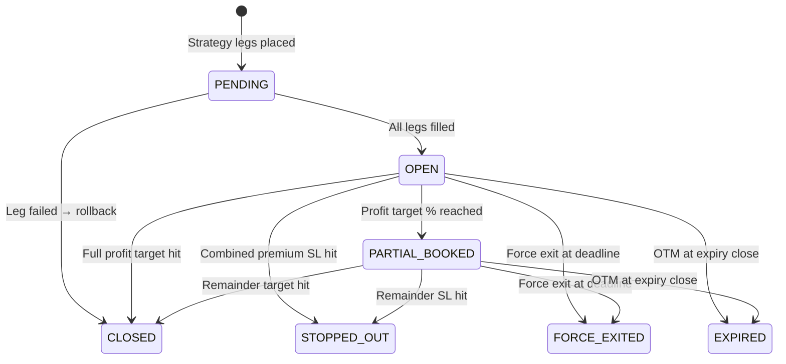
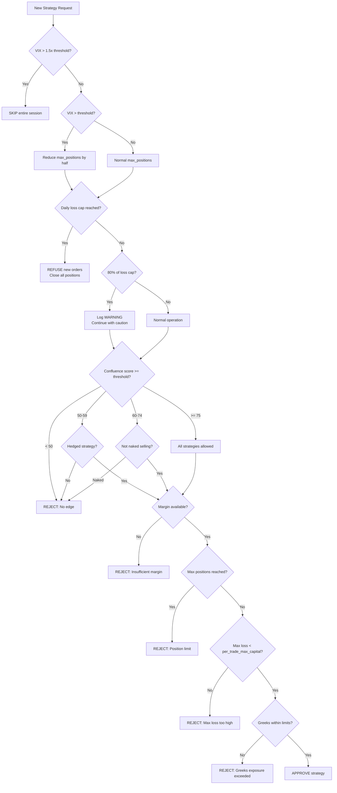

# Design Document: F&O Auto-Trader

## Overview

The F&O Auto-Trader is a new `fno/` Python package that extends Wealth Builder Pro with automated Nifty, BankNifty, and FinNifty index options and futures trading. It reuses the existing broker abstraction layer (`intraday/broker_base.py`), OAuth authentication (`intraday/auth_server.py`), config system (`config/config_loader.py`), and database layer (`database/db_manager.py`) — while introducing F&O-specific modules for option chain analysis, Greeks computation, multi-leg strategy construction, quantitative edge scoring, and derivative-specific risk management.

The system follows a pipeline architecture mirroring the intraday equity module: **Fetch Option Chains → Compute Greeks & Quant Signals → LLM Strategy Selection → Risk Validation → Order Execution → Position Monitoring → Force Exit → EOD Report**. Each stage is a discrete module with typed inputs/outputs.

Key design decisions:

- **Extend, don't fork the BrokerClient ABC**: Add `place_fno_order()`, `get_fno_positions()`, and `get_fno_margins()` abstract methods to the existing `BrokerClient` in `intraday/broker_base.py`. Both Dhan and Zerodha implementations get F&O support.
- **Quant Edge Engine as gatekeeper**: Every candidate strategy must pass through the 6-signal confluence scoring engine (IV Percentile, OI Velocity, IV Skew, GEX, VRP, PCR+MaxPain) before the LLM even sees it. Minimum confluence score of 60 to trade, 75 for naked selling. "No edge, no trade."
- **Paper trading mandatory first**: The system starts in paper mode with virtual ₹5L capital. Live mode requires `paper_trading_weeks` (default 3) of profitable paper history.
- **Strategy as first-class entity**: Unlike the intraday module where each trade is independent, F&O strategies are multi-leg constructs (2-4 legs) tracked as a single unit with aggregate Greeks, combined P&L, and coordinated exits.
- **LLM as advisor, quant as gatekeeper**: Claude Sonnet selects strategies from the 7-strategy playbook; the Quant Edge Engine provides the quantitative evidence and enforces minimum edge thresholds. The LLM cannot override the confluence score gate.
- **All times IST, all money INR, all quantities in lots**: No timezone, currency, or unit conversion anywhere.

## Architecture

### High-Level Component Diagram



### Data Flow Sequence



## Components and Interfaces

### Module Structure

```
fno/
├── __init__.py
├── config.py              # FnO_Config dataclass + validation
├── option_chain.py        # Option_Chain_Fetcher (OI, IV, PCR, MaxPain)
├── greeks.py              # FnO_Greeks_Calculator (Black-Scholes)
├── symbols.py             # Symbol_Builder (Dhan/Zerodha formats)
├── quant_engine.py        # Quant_Edge_Engine (6 signals + confluence)
├── strategy_engine.py     # FnO_Strategy_Engine (7-strategy playbook + LLM)
├── executor.py            # FnO_Order_Executor (multi-leg order placement)
├── paper_engine.py        # Paper_Trade_Engine (virtual capital simulation)
├── monitor.py             # FnO_Position_Monitor (state machine + Greeks tracking)
├── risk_manager.py        # FnO_Risk_Manager (SPAN margin, Greeks limits, loss caps)
├── reporter.py            # FnO_Reporter (EOD reports + strategy analytics)
├── dashboard.py           # FnO Dashboard JSON writer
└── models.py              # Shared dataclasses (FnOStrategySetup, StrategyLeg, etc.)

run_fno.py                 # Entry point (top-level, alongside run_intraday.py)
```

### Key Interfaces

#### FnO_Config (`fno/config.py`)

```python
@dataclass
class FnO_Config:
    broker: str = "dhan"
    mode: str = "paper"                    # "paper" or "live"
    paper_capital: float = 500_000.0       # ₹5L virtual capital
    daily_capital_limit: float = 500_000.0
    per_trade_max_capital: float = 100_000.0
    max_positions: int = 3
    allowed_indices: list[str] = field(default_factory=lambda: ["NIFTY", "BANKNIFTY", "FINNIFTY"])
    allowed_strategies: list[str] = field(default_factory=lambda: [
        "STRADDLE", "STRANGLE", "IRON_CONDOR",
        "BULL_CALL_SPREAD", "BEAR_PUT_SPREAD", "NAKED_CE", "NAKED_PE"
    ])
    max_lots_per_trade: int = 1
    force_exit_time: str = "15:15"
    entry_delay_minutes: int = 10
    monitor_interval_seconds: int = 60
    daily_loss_limit: float = 5_000.0
    max_delta_exposure: float = 50.0       # Net delta across all positions
    max_vega_exposure: float = 500.0       # Net vega across all positions
    min_days_to_expiry: int = 1
    target_profit_per_day: float = 5_000.0
    trailing_sl_trigger_pct: float = 50.0  # % of premium collected
    partial_book_pct: float = 50.0
    min_confidence_score: int = 7
    vix_threshold: float = 20.0
    paper_trading_weeks: int = 3
```

#### Strategy Models (`fno/models.py`)

```python
@dataclass
class StrategyLeg:
    """A single leg of a multi-leg F&O strategy."""
    index: str                  # "NIFTY", "BANKNIFTY", "FINNIFTY"
    strike_price: float
    expiry_date: str            # "YYYY-MM-DD"
    option_type: str            # "CE", "PE", "FUT"
    transaction_type: str       # "BUY" or "SELL"
    lot_size: int               # Exchange lot size (e.g., 25 for Nifty)
    num_lots: int
    entry_price: float          # Premium per unit
    tradingsymbol: str = ""     # Broker-specific symbol (filled by Symbol_Builder)

    @property
    def quantity(self) -> int:
        return self.lot_size * self.num_lots

    @property
    def is_sell(self) -> bool:
        return self.transaction_type == "SELL"


class FnOPositionState(str, Enum):
    PENDING = "PENDING"
    OPEN = "OPEN"
    PARTIAL_BOOKED = "PARTIAL_BOOKED"
    CLOSED = "CLOSED"
    STOPPED_OUT = "STOPPED_OUT"
    FORCE_EXITED = "FORCE_EXITED"
    EXPIRED = "EXPIRED"


class MarketRegime(str, Enum):
    SIDEWAYS = "SIDEWAYS"
    TRENDING_UP = "TRENDING_UP"
    TRENDING_DOWN = "TRENDING_DOWN"
    HIGH_VOLATILITY = "HIGH_VOLATILITY"


@dataclass
class FnOStrategySetup:
    """A complete multi-leg F&O strategy ready for execution."""
    strategy_type: str          # "IRON_CONDOR", "SHORT_STRANGLE", etc.
    index: str
    legs: list[StrategyLeg]
    net_premium: float          # Positive = credit, negative = debit
    max_profit: float
    max_loss: float
    net_delta: float
    net_gamma: float
    net_theta: float
    net_vega: float
    confidence_score: int
    rationale: str
    market_regime: str
    confluence_score: float     # From Quant Edge Engine
    expiry_date: str


@dataclass
class OptionStrike:
    """A single option contract from the option chain."""
    strike_price: float
    expiry_date: str
    option_type: str            # "CE" or "PE"
    ltp: float                  # Last traded price
    bid_price: float
    ask_price: float
    open_interest: int
    oi_change: int              # Change from previous day
    volume: int
    iv: float                   # Implied volatility (%)
    bid_ask_spread: float = 0.0


@dataclass
class OptionChainSnapshot:
    """Complete option chain snapshot for one index at one point in time."""
    index: str
    spot_price: float
    timestamp: str              # ISO 8601 IST
    expiry_date: str
    lot_size: int
    strikes: list[OptionStrike]
    atm_strike: float
    pcr: float                  # Put-Call Ratio
    max_pain: float
    highest_call_oi_strike: float
    highest_put_oi_strike: float


@dataclass
class QuantSignals:
    """All quantitative signals computed by the Quant Edge Engine."""
    iv_percentile: float        # 0-100
    iv_percentile_signal: str   # "SELL_PREMIUM", "BUY_PREMIUM", "USE_SPREADS"
    oi_velocity_support: list[dict]   # [{strike, oi_change_30m, flag}]
    oi_velocity_resistance: list[dict]
    iv_skew: float              # Put IV - Call IV (25-delta)
    iv_skew_signal: str         # "BEARISH", "BULLISH", "NEUTRAL"
    gex_map: list[dict]         # [{strike, net_gex}]
    gex_gravity_center: float   # Strike with highest positive GEX
    gex_regime: str             # "PINNED" or "TRENDING"
    vrp: float                  # IV - RV (percentage points)
    vrp_signal: str             # "STRONG_SELL", "WEAK_EDGE", "BUY_PREMIUM"
    confluence_score: float     # 0-100 composite
    confluence_breakdown: dict  # {ivp: 0-20, oi: 0-20, skew: 0-15, gex: 0-15, vrp: 0-15, pcr_mp: 0-15}


@dataclass
class Greeks:
    """Option Greeks for a single contract or aggregated portfolio."""
    delta: float
    gamma: float
    theta: float
    vega: float
```

#### Extended BrokerClient ABC (`intraday/broker_base.py` — additions)

```python
# Added to existing BrokerClient ABC:

@abstractmethod
def place_fno_order(
    self,
    tradingsymbol: str,
    exchange: str,           # "NFO"
    transaction_type: str,   # "BUY" or "SELL"
    order_type: str,         # "LIMIT", "MARKET", "SL"
    product_type: str,       # "NRML" or "MIS"
    quantity: int,
    price: float = 0.0,
    trigger_price: float = 0.0,
) -> dict:
    """Place F&O order. Returns {"broker_order_id": str, "status": str}"""
    ...

@abstractmethod
def get_fno_positions(self) -> list[dict]:
    """Returns normalized F&O positions: [{"tradingsymbol", "index_name",
    "option_type", "strike_price", "expiry_date", "quantity",
    "buy_avg", "sell_avg", "pnl", "product_type"}]"""
    ...

@abstractmethod
def get_fno_margins(self) -> dict:
    """Returns {"available_margin": float, "used_margin": float,
    "span_margin": float, "exposure_margin": float}"""
    ...
```

#### FnO_Greeks_Calculator (`fno/greeks.py`)

```python
class FnO_Greeks_Calculator:
    """Black-Scholes Greeks calculator for European-style index options."""

    RISK_FREE_RATE = 0.07  # 7% (India 10Y govt bond yield approx)

    def compute_greeks(
        self, spot: float, strike: float, tte: float,
        iv: float, option_type: str, r: float = RISK_FREE_RATE,
    ) -> Greeks:
        """Compute delta, gamma, theta, vega for a single option."""
        ...

    def compute_option_price(
        self, spot: float, strike: float, tte: float,
        iv: float, option_type: str, r: float = RISK_FREE_RATE,
    ) -> float:
        """Black-Scholes option price."""
        ...

    def implied_volatility(
        self, market_price: float, spot: float, strike: float,
        tte: float, option_type: str, r: float = RISK_FREE_RATE,
    ) -> float:
        """Compute IV from market price using Newton-Raphson root finding."""
        ...

    def strategy_greeks(self, legs: list[StrategyLeg], spot: float) -> Greeks:
        """Net Greeks for a multi-leg strategy (sum of leg Greeks × direction)."""
        ...
```

#### Symbol_Builder (`fno/symbols.py`)

```python
class Symbol_Builder:
    """Constructs broker-specific F&O trading symbols."""

    MONTH_CODES_ZERODHA = {1:'1',2:'2',3:'3',4:'4',5:'5',6:'6',
                           7:'7',8:'8',9:'9',10:'O',11:'N',12:'D'}
    MONTH_NAMES_DHAN = {1:'JAN',2:'FEB',3:'MAR',4:'APR',5:'MAY',6:'JUN',
                        7:'JUL',8:'AUG',9:'SEP',10:'OCT',11:'NOV',12:'DEC'}

    @staticmethod
    def build_dhan(index: str, expiry: date, strike: float, option_type: str) -> str:
        """e.g., NIFTY25JUL24500CE"""
        ...

    @staticmethod
    def build_zerodha(index: str, expiry: date, strike: float, option_type: str) -> str:
        """e.g., NIFTY2572524500CE"""
        ...

    @staticmethod
    def build_futures_dhan(index: str, expiry: date) -> str:
        """e.g., NIFTY25JULFUT"""
        ...

    @staticmethod
    def build_futures_zerodha(index: str, expiry: date) -> str:
        """e.g., NIFTY25725FUT"""
        ...

    @staticmethod
    def parse_symbol(symbol: str, broker: str) -> dict:
        """Parse a trading symbol back to {index, expiry, strike, option_type}."""
        ...
```

#### Quant_Edge_Engine (`fno/quant_engine.py`)

```python
class Quant_Edge_Engine:
    """Computes 6 institutional-grade quantitative signals."""

    def __init__(self, db: DBManager, config: FnO_Config):
        self.db = db
        self.config = config

    def compute_all_signals(
        self, chain: OptionChainSnapshot, greeks_calc: FnO_Greeks_Calculator,
    ) -> QuantSignals:
        """Compute all 6 signals and confluence score for an index."""
        ...

    def compute_iv_percentile(self, index: str, current_atm_iv: float) -> float:
        """IVP = % of last 252 days where ATM IV < today's ATM IV."""
        ...

    def compute_oi_velocity(
        self, snapshots: list[OptionChainSnapshot],
    ) -> tuple[list[dict], list[dict]]:
        """OI change velocity over last 30 min. Returns (support, resistance)."""
        ...

    def compute_iv_skew(
        self, chain: OptionChainSnapshot, greeks_calc: FnO_Greeks_Calculator,
    ) -> tuple[float, str]:
        """IV of 25-delta put minus IV of 25-delta call. Returns (skew, signal)."""
        ...

    def compute_gex(
        self, chain: OptionChainSnapshot, greeks_calc: FnO_Greeks_Calculator,
    ) -> tuple[list[dict], float, str]:
        """GEX at each strike. Returns (gex_map, gravity_center, regime)."""
        ...

    def compute_vrp(self, index: str, atm_iv: float) -> tuple[float, str]:
        """VRP = ATM IV - 20-day realized vol. Returns (vrp, signal)."""
        ...

    def compute_confluence_score(
        self, ivp: float, oi_support: list, oi_resistance: list,
        iv_skew: float, gex_regime: str, vrp: float,
        pcr: float, max_pain: float, spot: float,
        strategy_type: str,
    ) -> tuple[float, dict]:
        """Weighted confluence score (0-100) with breakdown."""
        ...

    def get_adaptive_weights(self, strategy_type: str) -> dict:
        """After 20+ days, adjust weights based on historical win rates."""
        ...
```

### LLM Prompt Templates

#### System Prompt for F&O Strategy Selection

```
You are an expert F&O (Futures & Options) trading analyst for Indian NSE index derivatives.
Your job is to select the optimal strategy from the 7-strategy playbook based on current
market conditions and quantitative signals.

STRATEGY PLAYBOOK:
1. IRON_CONDOR — Sell OTM CE + PE, buy further OTM protection. Sideways market, VIX 12-18.
2. SHORT_STRANGLE — Sell OTM CE + PE, no protection. High VIX (>16), range-bound, 3+ DTE.
3. BULL_PUT_SPREAD — Sell Put at support, buy lower Put. Bullish trend, OI-confirmed support.
4. BEAR_CALL_SPREAD — Sell Call at resistance, buy higher Call. Bearish trend, OI-confirmed resistance.
5. SHORT_STRADDLE — Sell ATM CE + PE. ONLY on expiry day, VIX < 18, no events.
6. LONG_STRADDLE — Buy ATM CE + PE. Before major events, VIX expected to spike.
7. DIRECTIONAL_BUY — Buy OTM CE (bullish) or PE (bearish). Clear breakout with volume.

MARKET REGIME: {market_regime}

QUANTITATIVE SIGNALS (from Quant Edge Engine):
- IV Percentile: {ivp}% → {ivp_signal}
- OI Velocity: Support walls at {oi_support_strikes}, Resistance walls at {oi_resistance_strikes}
- IV Skew: {iv_skew:.2f} → {iv_skew_signal}
- GEX Regime: {gex_regime}, Gravity Center: {gex_gravity}
- VRP: {vrp:.2f}pp → {vrp_signal}
- Confluence Score Range: {min_confluence}-{max_confluence}

RULES:
- ONLY recommend strategies where confluence score >= 60 (>= 75 for naked selling)
- Stop loss for premium selling: exit when combined premium moves 1.5x against collected premium
- No SHORT_STRANGLE or SHORT_STRADDLE entries after 2:00 PM IST
- No DIRECTIONAL buys after 1:00 PM IST
- On expiry day: ONLY SHORT_STRADDLE, IRON_CONDOR, or DIRECTIONAL allowed
- Max {max_lots} lots per leg, max {max_positions} total strategies

RESPOND WITH EXACTLY THIS JSON:
{{
  "strategies": [
    {{
      "strategy_type": "IRON_CONDOR|SHORT_STRANGLE|...",
      "index": "NIFTY|BANKNIFTY|FINNIFTY",
      "legs": [
        {{
          "strike": 24500,
          "option_type": "CE|PE",
          "transaction_type": "BUY|SELL",
          "num_lots": 1,
          "entry_price": 80.50
        }}
      ],
      "confidence_score": 8,
      "rationale": "Why this strategy with quant evidence"
    }}
  ],
  "market_assessment": "One-line market view",
  "regime_reasoning": "Why this regime classification"
}}
```

#### User Prompt Template

```
Date: {date} IST | Time: {time} IST
Index: {index} | Spot: ₹{spot_price} | VIX: {vix}
Days to Expiry: {dte} | Is Expiry Day: {is_expiry}

OPTION CHAIN (ATM ± 10 strikes, current expiry {expiry_date}):
Strike  | CE LTP | CE OI    | CE IV  | PE LTP | PE OI    | PE IV
{option_chain_table}

KEY LEVELS:
- ATM Strike: {atm_strike}
- Max Pain: {max_pain}
- PCR: {pcr:.2f}
- Highest Call OI: {highest_call_oi_strike} ({highest_call_oi:,} contracts)
- Highest Put OI: {highest_put_oi_strike} ({highest_put_oi:,} contracts)

QUANT SIGNALS:
- IV Percentile: {ivp:.1f}% (1Y rank) → {ivp_signal}
- OI Velocity (30min): {oi_velocity_summary}
- IV Skew (25Δ): {iv_skew:.2f} → {iv_skew_signal}
- GEX: {gex_regime} | Gravity: {gex_gravity} | Total GEX: {total_gex:,.0f}
- VRP: {vrp:.2f}pp (IV {atm_iv:.1f}% vs RV20d {rv20d:.1f}%) → {vrp_signal}
- Confluence Score: {confluence_score:.0f}/100

5-DAY PRICE TREND: {price_trend}
SECTOR MOMENTUM: {sector_summary}

Select the optimal strategy. Confluence >= 60 required (>= 75 for naked selling).
```


## Data Models

### Database Schema

#### `fno_trades` table

| Column | Type | Description |
|--------|------|-------------|
| id | INTEGER PK | Auto-increment |
| trade_date | TEXT | YYYY-MM-DD |
| timestamp | TEXT | ISO 8601 IST |
| index_name | TEXT | NIFTY / BANKNIFTY / FINNIFTY |
| tradingsymbol | TEXT | Broker-specific symbol |
| option_type | TEXT | CE / PE / FUT |
| strike_price | REAL | Strike price |
| expiry_date | TEXT | YYYY-MM-DD |
| action | TEXT | BUY / SELL |
| order_type | TEXT | LIMIT / MARKET / SL |
| quantity | INTEGER | Total units (lots × lot_size) |
| lots | INTEGER | Number of lots |
| price | REAL | Order price (premium per unit) |
| trigger_price | REAL | SL trigger price |
| broker_order_id | TEXT | Broker-specific order ID |
| broker_name | TEXT | "dhan" or "zerodha" |
| status | TEXT | PENDING/OPEN/CLOSED/STOPPED_OUT/FORCE_EXITED/EXPIRED |
| entry_price | REAL | Actual fill premium |
| exit_price | REAL | Actual exit premium |
| pnl | REAL | Realized P&L for this leg |
| mode | TEXT | PAPER / LIVE |
| strategy_id | INTEGER FK | References fno_strategies.id |

#### `fno_strategies` table

| Column | Type | Description |
|--------|------|-------------|
| id | INTEGER PK | Auto-increment |
| trade_date | TEXT | YYYY-MM-DD |
| timestamp | TEXT | ISO 8601 IST |
| strategy_type | TEXT | IRON_CONDOR / SHORT_STRANGLE / etc. |
| index_name | TEXT | NIFTY / BANKNIFTY / FINNIFTY |
| legs_json | TEXT | JSON array of leg details |
| net_premium | REAL | Net premium collected/paid |
| max_profit | REAL | Theoretical max profit |
| max_loss | REAL | Theoretical max loss |
| net_delta | REAL | Aggregate delta |
| net_gamma | REAL | Aggregate gamma |
| net_theta | REAL | Aggregate theta |
| net_vega | REAL | Aggregate vega |
| status | TEXT | PENDING/OPEN/PARTIAL_BOOKED/CLOSED/STOPPED_OUT/FORCE_EXITED/EXPIRED |
| entry_time | TEXT | ISO 8601 IST |
| exit_time | TEXT | ISO 8601 IST (nullable) |
| realized_pnl | REAL | Final P&L |
| mode | TEXT | PAPER / LIVE |
| confidence_score | INTEGER | LLM confidence (1-10) |
| confluence_score | REAL | Quant Edge confluence (0-100) |
| rationale | TEXT | LLM rationale |

#### `fno_daily_summary` table

| Column | Type | Description |
|--------|------|-------------|
| id | INTEGER PK | Auto-increment |
| trade_date | TEXT | YYYY-MM-DD |
| total_strategies | INTEGER | Count of strategies executed |
| winning_strategies | INTEGER | Count with positive P&L |
| losing_strategies | INTEGER | Count with negative P&L |
| total_pnl | REAL | Net P&L for the day |
| total_realized_loss | REAL | Sum of losing strategy P&L |
| max_drawdown | REAL | Peak-to-trough intraday |
| broker_name | TEXT | "dhan" or "zerodha" |
| mode | TEXT | PAPER / LIVE |
| paper_capital_remaining | REAL | Remaining virtual capital (paper mode) |

#### `fno_iv_history` table (for IV Percentile computation)

| Column | Type | Description |
|--------|------|-------------|
| id | INTEGER PK | Auto-increment |
| date | TEXT | YYYY-MM-DD (unique per index) |
| index_name | TEXT | NIFTY / BANKNIFTY / FINNIFTY |
| atm_iv | REAL | ATM implied volatility (%) |
| spot_close | REAL | Spot closing price |

#### `fno_spot_history` table (for Realized Volatility computation)

| Column | Type | Description |
|--------|------|-------------|
| id | INTEGER PK | Auto-increment |
| date | TEXT | YYYY-MM-DD (unique per index) |
| index_name | TEXT | NIFTY / BANKNIFTY / FINNIFTY |
| close_price | REAL | Daily closing price |
| log_return | REAL | ln(close/prev_close) |

#### Audit Log Extension

The existing `intraday_audit_log` table is reused with `FNO_` prefixed event types:
- `FNO_SCAN` — Option chain fetch
- `FNO_QUANT_SIGNALS` — Quant Edge Engine output
- `FNO_REGIME_CLASSIFIED` — Market regime classification
- `FNO_LLM_PROMPT` — Full LLM prompt sent
- `FNO_LLM_RESPONSE` — Full LLM response received
- `FNO_STRATEGY_SELECTED` — Strategy validated and approved
- `FNO_ORDER_PLACED` — Individual leg order placed
- `FNO_ORDER_MODIFIED` — Order modified
- `FNO_ORDER_CANCELLED` — Order cancelled
- `FNO_POSITION_UPDATE` — Position state change with Greeks snapshot
- `FNO_SL_ADJUST` — Stop loss adjusted
- `FNO_EXIT` — Strategy exited (target/SL/force/expiry)
- `FNO_ERROR` — Error event

### Position State Machine



### Config Schema Addition

```yaml
# Added to config/config.yaml
fno:
  broker: "dhan"
  mode: "paper"                     # "paper" or "live"
  paper_capital: 500000             # ₹5L virtual capital
  daily_capital_limit: 500000
  per_trade_max_capital: 100000
  max_positions: 3
  allowed_indices:
    - "NIFTY"
    - "BANKNIFTY"
    - "FINNIFTY"
  allowed_strategies:
    - "STRADDLE"
    - "STRANGLE"
    - "IRON_CONDOR"
    - "BULL_CALL_SPREAD"
    - "BEAR_PUT_SPREAD"
    - "NAKED_CE"
    - "NAKED_PE"
  max_lots_per_trade: 1
  force_exit_time: "15:15"
  entry_delay_minutes: 10
  monitor_interval_seconds: 60
  daily_loss_limit: 5000
  max_delta_exposure: 50
  max_vega_exposure: 500
  min_days_to_expiry: 1
  target_profit_per_day: 5000
  trailing_sl_trigger_pct: 50       # % of premium collected
  partial_book_pct: 50
  min_confidence_score: 7
  vix_threshold: 20
  paper_trading_weeks: 3
```

### Dashboard JSON API Structure (`dashboard/api/fno_latest.json`)

```json
{
  "updated_at": "2026-07-15T14:30:00+05:30",
  "mode": "PAPER",
  "broker": "dhan",
  "session_active": true,
  "paper_capital_remaining": 485000.0,
  "today": {
    "strategies": [
      {
        "strategy_type": "IRON_CONDOR",
        "index": "NIFTY",
        "legs_summary": "Sell 24800CE + Buy 24900CE + Sell 24200PE + Buy 24100PE",
        "entry_premium": 95.50,
        "current_premium": 72.30,
        "unrealized_pnl": 580.0,
        "status": "OPEN",
        "confluence_score": 78,
        "net_greeks": {"delta": -2.5, "gamma": -0.8, "theta": 45.2, "vega": -12.3}
      }
    ],
    "total_pnl": 1580.0,
    "realized_loss": 0.0,
    "daily_loss_cap": 5000.0,
    "loss_cap_pct": 0.0,
    "net_greeks": {"delta": -2.5, "gamma": -0.8, "theta": 45.2, "vega": -12.3}
  },
  "history": {
    "daily_pnl": [{"date": "2026-07-14", "pnl": 2200}, {"date": "2026-07-13", "pnl": -800}],
    "cumulative_pnl": 12500.0,
    "win_rate": 68.5,
    "total_days": 15,
    "strategy_breakdown": {
      "IRON_CONDOR": {"count": 8, "win_rate": 75.0, "total_pnl": 8500},
      "SHORT_STRANGLE": {"count": 5, "win_rate": 60.0, "total_pnl": 3200}
    }
  }
}
```

### Quant Edge Engine — Computation Details

#### IV Percentile Computation

```python
def compute_iv_percentile(index: str, current_atm_iv: float, iv_history: list[float]) -> float:
    """
    IVP = (count of days where historical ATM IV < current ATM IV) / total_days × 100
    Uses last 252 trading days (1 year). Bootstraps from 30 days on first run.
    """
    if not iv_history:
        return 50.0  # Neutral default
    days_below = sum(1 for iv in iv_history if iv < current_atm_iv)
    return (days_below / len(iv_history)) * 100
```

Signal mapping:
- IVP > 70 → "SELL_PREMIUM" (options expensive, sell strangles/iron condors)
- IVP < 30 → "BUY_PREMIUM" (options cheap, buy straddles/directional)
- 30 ≤ IVP ≤ 70 → "USE_SPREADS" (neutral zone, use defined-risk spreads)

#### OI Change Velocity

```python
def compute_oi_velocity(snapshots: list[OptionChainSnapshot]) -> tuple:
    """
    Compare OI at each strike between latest snapshot and snapshot from ~30 min ago.
    Flag strikes where Put OI increased > 500,000 as "institutional support".
    Flag strikes where Call OI increased > 500,000 as "institutional resistance".
    """
    if len(snapshots) < 2:
        return [], []
    latest = snapshots[-1]
    oldest = snapshots[0]  # ~30 min ago (6 snapshots × 5 min)
    # Compute delta OI per strike, flag large changes
    ...
```

#### IV Skew

```python
def compute_iv_skew(chain: OptionChainSnapshot, greeks_calc) -> tuple[float, str]:
    """
    Find the 25-delta Put and 25-delta Call strikes.
    Skew = IV(25Δ Put) - IV(25Δ Call)
    Compare to 5-day average skew for signal.
    """
    # Find strikes closest to 25-delta for puts and calls
    # Skew widening → BEARISH, narrowing → BULLISH
    ...
```

#### GEX (Gamma Exposure) Mapping

```python
def compute_gex(chain: OptionChainSnapshot, greeks_calc) -> tuple:
    """
    For each strike:
      GEX = Σ(OI × gamma × lot_size × spot / 100)
      Call gamma is positive, Put gamma is negative.
    Gravity center = strike with highest positive GEX.
    Total GEX < 0 → TRENDING day. Total GEX > 0 → PINNED day.
    """
    ...
```

#### VRP (Volatility Risk Premium)

```python
def compute_vrp(atm_iv: float, spot_history: list[float]) -> tuple[float, str]:
    """
    RV_20d = std(log_returns[-20:]) × √252 × 100
    VRP = ATM_IV - RV_20d
    VRP > 5 → "STRONG_SELL" | VRP 2-5 → "MODERATE_SELL" | VRP < 2 → "WEAK_EDGE" | VRP < 0 → "BUY_PREMIUM"
    """
    import math
    log_returns = [math.log(spot_history[i]/spot_history[i-1]) for i in range(1, len(spot_history))]
    rv_20d = (sum(r**2 for r in log_returns[-20:]) / 20) ** 0.5 * math.sqrt(252) * 100
    vrp = atm_iv - rv_20d
    ...
```

#### Confluence Score

```python
def compute_confluence_score(signals: dict, strategy_type: str) -> tuple[float, dict]:
    """
    Weighted composite score (0-100):
    - IV Percentile:    0-20 points (max when IVP > 80 for selling, < 20 for buying)
    - OI Velocity:      0-20 points (max when clear institutional walls visible)
    - IV Skew:          0-15 points (max when skew confirms strategy direction)
    - GEX:              0-15 points (max when GEX regime matches strategy)
    - VRP:              0-15 points (max when VRP > 5 for selling strategies)
    - PCR + Max Pain:   0-15 points (max when both confirm same direction)

    Thresholds:
    - >= 75: Naked selling allowed
    - >= 60: Any strategy allowed
    - >= 50: Hedged strategies only (iron condors, spreads)
    - < 50: No trade
    """
    ...
```

### Risk Management Decision Tree




## Correctness Properties

*A property is a characteristic or behavior that should hold true across all valid executions of a system — essentially, a formal statement about what the system should do. Properties serve as the bridge between human-readable specifications and machine-verifiable correctness guarantees.*

### Property 1: Config defaults and invalid value rejection

*For any* subset of F&O config keys omitted from the YAML input, and *for any* config key set to a value outside its valid range (e.g., negative `daily_loss_limit`, zero `max_positions`, `min_confidence_score` > 10, `mode` not in ["paper", "live"], `max_lots_per_trade` < 1), loading the config SHALL produce an `FnO_Config` where every omitted or invalid key has its documented default value, and every valid provided key retains its provided value.

**Validates: Requirements 1.1, 1.2, 1.3, 1.8, 1.9, 1.10**

### Property 2: ATM strike identification

*For any* spot price and *any* non-empty list of strike prices, the identified ATM strike SHALL be the strike price with the minimum absolute difference from the spot price. If two strikes are equidistant, the lower strike SHALL be chosen.

**Validates: Requirements 2.3**

### Property 3: PCR computation

*For any* option chain snapshot with at least one Call and one Put strike having positive OI, the computed PCR SHALL equal the sum of all Put OI divided by the sum of all Call OI. If total Call OI is zero, PCR SHALL be infinity.

**Validates: Requirements 2.9, 4.5**

### Property 4: Max Pain computation

*For any* option chain snapshot with strikes and OI data, the computed Max Pain strike SHALL be the strike that minimizes the total pain function: Σ(max(0, strike - S) × Call_OI_at_S + max(0, S - strike) × Put_OI_at_S) across all strikes S. The Max Pain strike SHALL always be one of the strikes present in the option chain.

**Validates: Requirements 2.10, 4.6**

### Property 5: Option chain snapshot buffer

*For any* sequence of N option chain snapshots added to the buffer, the buffer SHALL contain at most 6 snapshots, and those 6 SHALL be the most recently added snapshots in chronological order.

**Validates: Requirements 2.8**

### Property 6: Black-Scholes Greeks round-trip

*For any* valid option parameters (spot > 0, strike > 0, 0 < tte ≤ 2, 0.01 ≤ iv ≤ 3.0, option_type in {CE, PE}), computing the option price using Black-Scholes and then deriving IV from that price using root-finding SHALL produce an IV within 0.01 of the original IV. Additionally, computing Greeks from the derived IV SHALL produce values within 0.01 of the original Greeks.

**Validates: Requirements 3.1, 3.2, 3.4, 3.5**

### Property 7: Net strategy Greeks are additive

*For any* multi-leg strategy with N legs, the net Greeks (delta, gamma, theta, vega) SHALL equal the sum of each leg's Greeks multiplied by its direction (+1 for BUY, -1 for SELL) and quantity. Formally: net_delta = Σ(leg_delta × direction × quantity) for all legs.

**Validates: Requirements 3.3**

### Property 8: Market regime classification

*For any* combination of VIX value, 3-day price range, and OI data: (a) if VIX > 20 or an event flag is set, regime SHALL be HIGH_VOLATILITY, (b) if the index made higher highs and higher lows over 3 days with bullish OI, regime SHALL be TRENDING_UP, (c) if lower highs and lower lows with bearish OI, regime SHALL be TRENDING_DOWN, (d) if VIX 10-15 and range-bound, regime SHALL be SIDEWAYS. The classification SHALL always produce exactly one of the 4 regimes.

**Validates: Requirements 4.3**

### Property 9: Strategy validation

*For any* dict representing an LLM strategy recommendation, the validation function SHALL accept the recommendation if and only if: (a) strategy_type is in the 7-strategy playbook, (b) all legs have valid strikes present in the option chain, (c) confidence_score >= `min_confidence_score`, (d) expiry >= `min_days_to_expiry` (except for expiry-day strategies), (e) max_loss does not exceed `per_trade_max_capital`, and (f) confluence_score meets the minimum threshold for that strategy type (75 for naked, 60 for general, 50 for hedged).

**Validates: Requirements 4.7, 4.9**

### Property 10: Time-of-day rules

*For any* strategy type and *any* IST time: (a) SHORT_STRADDLE and SHORT_STRANGLE entries SHALL be rejected after 14:00 IST, (b) DIRECTIONAL buys SHALL be rejected after 13:00 IST, (c) all other strategies SHALL be allowed at any time during market hours.

**Validates: Requirements 4.10**

### Property 11: Expiry-day strategy filtering

*For any* strategy type, when the current day is an expiry day: only SHORT_STRADDLE, IRON_CONDOR, and DIRECTIONAL strategies SHALL be allowed. SHORT_STRANGLE SHALL be rejected on expiry day regardless of other conditions.

**Validates: Requirements 4.11**

### Property 12: Multi-leg execution ordering

*For any* multi-leg strategy, the execution order SHALL place all SELL legs before all BUY legs. Within each group, the order is unspecified.

**Validates: Requirements 5.2**

### Property 13: Symbol construction round-trip

*For any* valid combination of index (NIFTY, BANKNIFTY, FINNIFTY), expiry date, strike price (positive multiple of the index's tick size), and option type (CE, PE), and *for each* broker (dhan, zerodha): constructing the trading symbol and then parsing it back SHALL produce the original index, expiry date, strike price, and option type.

**Validates: Requirements 13.1, 13.2, 13.3, 13.4**

### Property 14: Invalid symbol inputs rejected

*For any* invalid index name (not in allowed list), negative strike price, zero strike price, or invalid option type (not CE/PE/FUT), the Symbol_Builder SHALL raise a ValueError.

**Validates: Requirements 13.5**

### Property 15: Position state machine transitions

*For any* current state and event, the state machine SHALL only allow valid transitions: PENDING→OPEN (fill), PENDING→CLOSED (cancel), OPEN→{PARTIAL_BOOKED, CLOSED, STOPPED_OUT, FORCE_EXITED, EXPIRED}, PARTIAL_BOOKED→{CLOSED, STOPPED_OUT, FORCE_EXITED, EXPIRED}. All other transitions SHALL be rejected.

**Validates: Requirements 6.5**

### Property 16: Premium-based stop loss trigger

*For any* sold strategy with collected premium > 0 and current combined premium, the stop loss SHALL trigger if and only if the current premium exceeds the collected premium × (1 + trailing_sl_trigger_pct / 100). The trigger decision SHALL be monotonic: once triggered, it cannot un-trigger.

**Validates: Requirements 6.6**

### Property 17: Partial profit booking

*For any* open strategy with max_profit > 0 and current_profit, partial booking SHALL trigger if and only if current_profit >= max_profit × partial_book_pct / 100. After partial booking, the strategy status SHALL transition to PARTIAL_BOOKED.

**Validates: Requirements 6.7**

### Property 18: Greeks exposure warnings

*For any* set of open positions with computed net Greeks, a delta warning SHALL fire if and only if |net_delta| > max_delta_exposure, and a vega warning SHALL fire if and only if |net_vega| > max_vega_exposure. Both warnings are independent.

**Validates: Requirements 6.3, 6.4**

### Property 19: Margin enforcement

*For any* strategy with estimated margin requirement and *any* available margin (real or paper), the strategy SHALL be rejected if and only if the estimated margin exceeds the available margin. Paper mode SHALL use virtual capital for this check.

**Validates: Requirements 7.1, 7.2, 8.3**

### Property 20: Position and lot limits

*For any* count of open positions and *any* strategy with N lots per leg: (a) the strategy SHALL be rejected if open positions >= max_positions, and (b) the strategy SHALL be rejected if any leg has num_lots > max_lots_per_trade.

**Validates: Requirements 7.3, 7.4**

### Property 21: Daily loss cap enforcement

*For any* sequence of strategy P&L values and *any* daily_loss_limit > 0: the cumulative realized loss (sum of absolute values of negative P&Ls) SHALL be correctly tracked. The cap breach flag SHALL be True if and only if cumulative_realized_loss >= daily_loss_limit. The warning flag SHALL be True if and only if (cumulative_realized_loss + unrealized_loss) >= 0.8 × daily_loss_limit.

**Validates: Requirements 7.5, 7.6**

### Property 22: VIX-based session control

*For any* VIX value and vix_threshold > 0: (a) if VIX > 1.5 × vix_threshold, the session SHALL be skipped entirely, (b) if vix_threshold < VIX ≤ 1.5 × vix_threshold, max_positions SHALL be halved, (c) if VIX ≤ vix_threshold, max_positions SHALL remain unchanged.

**Validates: Requirements 7.8**

### Property 23: Performance metrics computation

*For any* non-empty list of strategy P&L values, the computed metrics SHALL satisfy: (a) win_rate = winning_count / total_count × 100, (b) avg_profit = sum(positive_pnls) / winning_count (or 0), (c) avg_loss = sum(negative_pnls) / losing_count (or 0), (d) expectancy = avg_profit × win_rate/100 - |avg_loss| × (1 - win_rate/100), (e) profit_factor = sum(positive_pnls) / |sum(negative_pnls)| (or ∞ if no losses).

**Validates: Requirements 10.2, 10.3, 10.5**

### Property 24: Maximum drawdown

*For any* sequence of daily P&L values, the maximum drawdown SHALL equal the largest peak-to-trough decline in the cumulative sum series. For a monotonically increasing series, max drawdown SHALL be 0. For an empty series, max drawdown SHALL be 0.

**Validates: Requirements 10.4**

### Property 25: IV Percentile computation

*For any* current ATM IV value and *any* non-empty list of historical ATM IV values (up to 252), the IV Percentile SHALL equal (count of historical values strictly less than current) / len(history) × 100. IVP SHALL always be in [0, 100].

**Validates: Requirements 16.1**

### Property 26: OI Change Velocity

*For any* two option chain snapshots taken at different times, the OI velocity at each strike SHALL equal (latest_OI - earlier_OI). Strikes where Put OI increased by > 500,000 SHALL be flagged as institutional support. Strikes where Call OI increased by > 500,000 SHALL be flagged as institutional resistance.

**Validates: Requirements 16.2**

### Property 27: VRP computation

*For any* ATM IV value and *any* list of at least 20 daily closing prices, the VRP SHALL equal ATM_IV - RV_20d, where RV_20d = std(last 20 log returns) × √252 × 100. VRP > 5 SHALL signal "STRONG_SELL", 2 ≤ VRP ≤ 5 SHALL signal "MODERATE_SELL", 0 ≤ VRP < 2 SHALL signal "WEAK_EDGE", VRP < 0 SHALL signal "BUY_PREMIUM".

**Validates: Requirements 16.5**

### Property 28: Confluence score bounds and thresholds

*For any* set of sub-scores (IVP: 0-20, OI: 0-20, Skew: 0-15, GEX: 0-15, VRP: 0-15, PCR+MP: 0-15), the confluence score SHALL equal their sum and SHALL always be in [0, 100]. The "no trade" decision SHALL be made if and only if the score < 50 for hedged strategies, < 60 for general strategies, or < 75 for naked selling strategies.

**Validates: Requirements 16.6, 16.12**

### Property 29: Max loss computation for defined-risk strategies

*For any* IRON_CONDOR with call spread width W_c and put spread width W_p and net premium collected P, the max loss SHALL equal max(W_c, W_p) × lot_size × num_lots - P × lot_size × num_lots. *For any* vertical spread (BULL_PUT_SPREAD, BEAR_CALL_SPREAD) with spread width W and net premium P, max loss SHALL equal (W - P) × lot_size × num_lots.

**Validates: Requirements 4.9**

### Property 30: Adaptive strategy weighting

*For any* trading history with 20+ days and *any* strategy type, if the strategy's historical win rate > 60%, its confluence score bonus SHALL be positive. If win rate < 40%, the bonus SHALL be negative. If history has < 20 days, no adjustment SHALL be applied.

**Validates: Requirements 16.11**


## Error Handling

### Error Categories and Strategies

| Category | Examples | Strategy |
|----------|----------|----------|
| **Config errors** | Missing `fno` section, invalid values, missing broker config | Use defaults + log warning (missing section), exit with error (missing broker config) |
| **Auth errors** | OAuth timeout, expired token | Delete session file, retry once, abort if retry fails |
| **Option chain fetch errors** | NSE/broker API timeout, empty chain, stale data | Retry once after 30s, abort session if retry fails |
| **Greeks computation errors** | Division by zero (zero TTE), convergence failure (IV root-finding) | Return intrinsic value for zero TTE, cap IV iterations at 100, use last known IV on failure |
| **Quant Engine errors** | Insufficient IV history (<30 days), insufficient spot history (<20 days) | Use neutral defaults (IVP=50, VRP=0), log warning, reduce confluence score |
| **LLM errors** | Empty response, invalid JSON, timeout, missing fields | Abort trading session — never trade without validated AI recommendation |
| **Strategy validation errors** | Invalid strategy type, missing legs, confluence below threshold | Reject strategy, log reason, continue evaluating other candidates |
| **Order execution errors** | Broker rejection, insufficient margin, partial leg failure | Cancel all placed legs of failed strategy, log error, continue with remaining strategies |
| **Paper engine errors** | Virtual capital exhausted, margin computation failure | Reject trade, log warning, continue monitoring existing positions |
| **Position monitoring errors** | Broker position fetch failure, Greeks computation failure | Retry on next interval, use last known values, don't close on transient errors |
| **Loss cap breach** | Cumulative loss >= daily_loss_limit | Immediately cancel all pending, close all open positions, refuse new orders |
| **State machine errors** | Invalid transition, duplicate state update | Log error, skip operation, continue monitoring |

### Error Handling Principles

1. **Never trade without edge**: If quant signals, option chain, or LLM fails, abort. No "best guess" F&O trading — the risk is too high.
2. **Atomic multi-leg execution**: If any leg of a strategy fails, roll back all previously placed legs. Never leave a partially hedged position.
3. **Fail-soft on monitoring**: If a single position check fails, retry next interval. Don't panic-close everything on a transient network error.
4. **Fail-hard on loss cap**: Loss cap enforcement is non-negotiable. Any breach triggers immediate shutdown of all F&O activity.
5. **Paper mode safety net**: Paper mode errors never affect real capital. Log and continue.
6. **Log everything to audit trail**: Every error goes to both Python logging and the `intraday_audit_log` table with `FNO_ERROR` event type, including full stack traces.
7. **Graceful degradation for quant signals**: If one signal (e.g., IV history too short for IVP) fails, use neutral defaults and reduce that signal's contribution to confluence score rather than aborting entirely.

### Specific Error Flows

**Multi-leg order partial failure:**
```
FnO_Order_Executor.execute_strategy() → place leg 1 (SELL CE) ✓ → place leg 2 (SELL PE) ✗
  → Cancel leg 1 (SELL CE) via broker.cancel_order()
  → Audit: FNO_ERROR with details of partial execution
  → Strategy status → CLOSED (failed)
  → Continue with next strategy candidate (if any)
```

**Quant Engine insufficient history:**
```
Quant_Edge_Engine.compute_iv_percentile() → IV history has only 15 days (need 30 min)
  → Use IVP = 50.0 (neutral)
  → Set IVP sub-score contribution to 0 (no signal)
  → Log: WARNING "IV history insufficient (15/30 days), using neutral IVP"
  → Continue with reduced confluence score
```

**LLM returns strategy with invalid strikes:**
```
FnO_Strategy_Engine.validate_strategy() → leg strike 24550 not in option chain
  → Reject this strategy
  → Audit: FNO_ERROR with "Strike 24550 not found in option chain"
  → If other strategies in LLM response, evaluate those
  → If zero valid strategies remain, abort session
```

**Token expiry during monitoring:**
```
BrokerClient.get_fno_positions() → HTTP 401
  → Delete config/.broker_session.json
  → Attempt re-auth (one retry)
  → If success: resume monitoring
  → If failure: force-exit all positions using last known prices, generate report
```

## Testing Strategy

### Testing Approach

The testing strategy uses a dual approach:

1. **Property-based tests** (using `hypothesis` library): Verify the 30 correctness properties above with 100+ random iterations each. These cover the core business logic — config validation, Greeks computation, symbol construction, quant signal computation, risk management, and performance metrics.

2. **Example-based unit tests** (using `pytest`): Cover specific scenarios, edge cases, integration points, error conditions, and multi-leg strategy construction that don't benefit from randomized input.

### Property-Based Testing Configuration

- Library: `hypothesis` (already in project — `.hypothesis/` directory exists)
- Minimum iterations: 100 per property (`@settings(max_examples=100)`)
- Each test tagged with: `# Feature: fno-auto-trader, Property {N}: {title}`
- Test file: `tests/test_fno_properties.py`

### Test Organization

```
tests/
├── test_fno_properties.py         # All 30 property-based tests
├── test_fno_config.py             # Config loading examples + edge cases
├── test_fno_greeks.py             # Greeks calculator edge cases (zero TTE, deep ITM/OTM)
├── test_fno_symbols.py            # Symbol construction examples per broker
├── test_fno_quant_engine.py       # Quant signal computation examples + edge cases
├── test_fno_strategy_engine.py    # Strategy playbook + LLM response validation
├── test_fno_executor.py           # Order execution + multi-leg rollback
├── test_fno_paper_engine.py       # Paper trading simulation
├── test_fno_monitor.py            # Position monitoring state machine
├── test_fno_risk_manager.py       # Margin, position limits, loss caps
├── test_fno_reporter.py           # EOD report generation + metrics
└── test_fno_dashboard.py          # Dashboard JSON structure validation
```

### Property Test Coverage Map

| Property | Module Under Test | Key Generators |
|----------|-------------------|----------------|
| 1: Config defaults | `fno/config.py` | Random config dicts with missing/invalid keys |
| 2: ATM strike | `fno/option_chain.py` | Random spot prices + strike lists |
| 3: PCR | `fno/option_chain.py` | Random OI distributions |
| 4: Max Pain | `fno/option_chain.py` | Random strike/OI combinations |
| 5: Snapshot buffer | `fno/option_chain.py` | Random snapshot sequences |
| 6: Greeks round-trip | `fno/greeks.py` | Random (spot, strike, tte, iv, type) |
| 7: Net strategy Greeks | `fno/greeks.py` | Random multi-leg strategies |
| 8: Market regime | `fno/strategy_engine.py` | Random (VIX, trend, OI) |
| 9: Strategy validation | `fno/strategy_engine.py` | Random strategy recommendation dicts |
| 10: Time-of-day rules | `fno/strategy_engine.py` | Random (time, strategy_type) |
| 11: Expiry-day rules | `fno/strategy_engine.py` | Random (strategy_type, is_expiry) |
| 12: Execution ordering | `fno/executor.py` | Random multi-leg strategies |
| 13: Symbol round-trip | `fno/symbols.py` | Random (index, expiry, strike, type) |
| 14: Invalid symbol rejection | `fno/symbols.py` | Random invalid inputs |
| 15: State machine | `fno/monitor.py` | Random (state, event) pairs |
| 16: Premium SL trigger | `fno/monitor.py` | Random (collected, current, threshold) |
| 17: Partial profit booking | `fno/monitor.py` | Random (max_profit, current, threshold) |
| 18: Greeks exposure warnings | `fno/monitor.py` | Random (net_greeks, thresholds) |
| 19: Margin enforcement | `fno/risk_manager.py` | Random (margin_req, available) |
| 20: Position/lot limits | `fno/risk_manager.py` | Random (counts, limits) |
| 21: Loss cap enforcement | `fno/risk_manager.py` | Random P&L sequences |
| 22: VIX session control | `fno/risk_manager.py` | Random (VIX, threshold) |
| 23: Performance metrics | `fno/reporter.py` | Random P&L value lists |
| 24: Max drawdown | `fno/reporter.py` | Random daily P&L sequences |
| 25: IV Percentile | `fno/quant_engine.py` | Random IV histories + current IV |
| 26: OI Change Velocity | `fno/quant_engine.py` | Random snapshot pairs |
| 27: VRP | `fno/quant_engine.py` | Random spot histories + ATM IV |
| 28: Confluence score | `fno/quant_engine.py` | Random sub-scores |
| 29: Max loss computation | `fno/strategy_engine.py` | Random spread parameters |
| 30: Adaptive weighting | `fno/quant_engine.py` | Random trading histories |

### Example-Based Test Scenarios

Key scenarios that complement the property tests:

- **Strategy construction**: Build each of the 7 strategy types with concrete market data, verify leg structure
- **Multi-leg rollback**: Mock broker to fail on 2nd leg, verify 1st leg cancelled
- **Paper trading lifecycle**: Full cycle from virtual capital → strategy execution → P&L tracking → capital update
- **Dashboard JSON**: Verify exact JSON structure matches frontend expectations
- **LLM prompt construction**: Verify all quant signals appear in prompt with correct formatting
- **Expiry-day scenarios**: Test each strategy type on expiry day, verify only allowed ones pass
- **Live mode gate**: Verify live mode rejected without sufficient paper history
- **Audit trail completeness**: Verify all FNO_ event types logged for a full trading session
