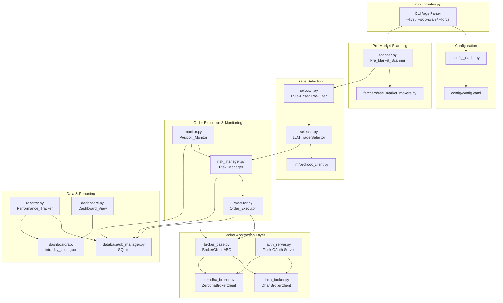
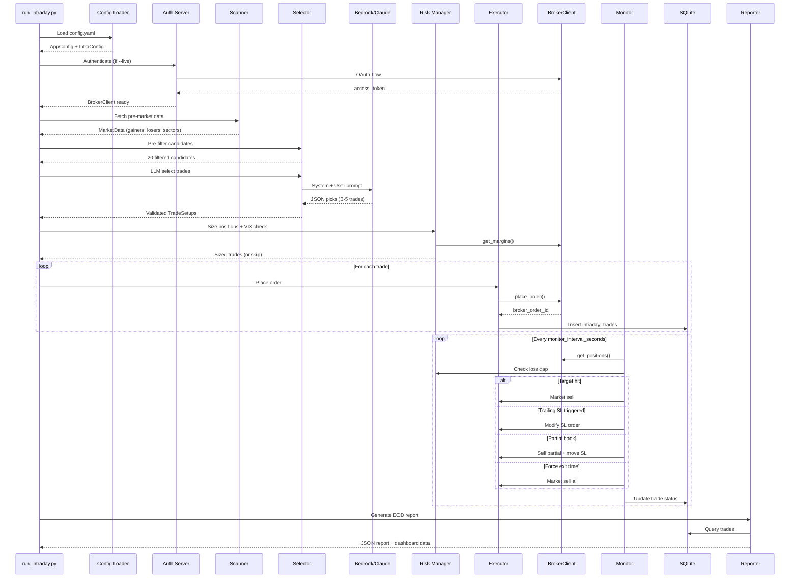
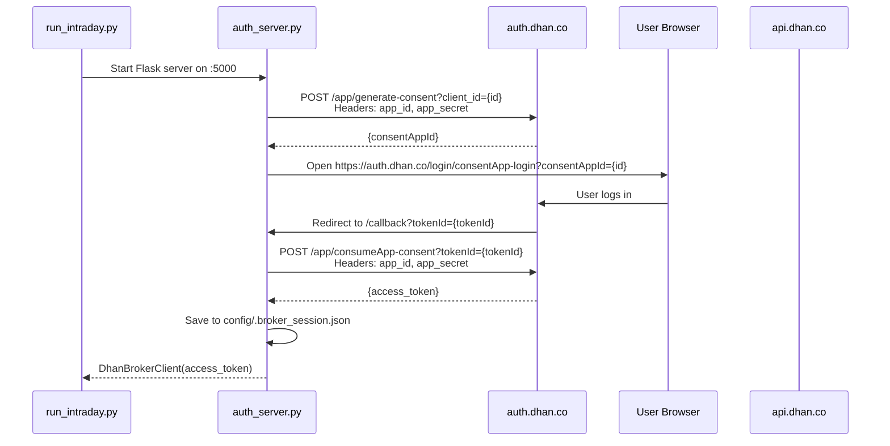
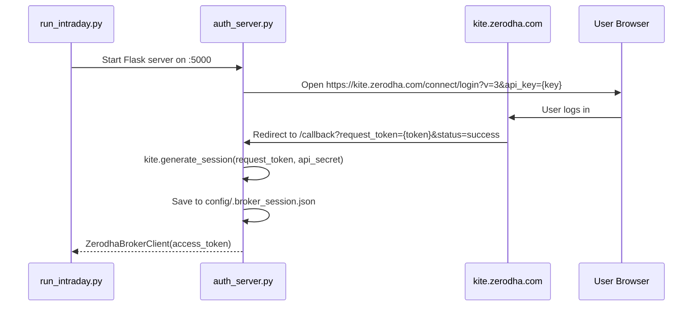
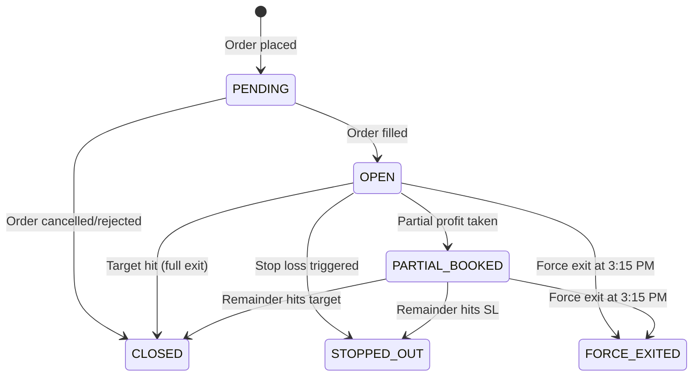

# Design Document: Intraday Auto-Trader

## Overview

The Intraday Auto-Trader is a modular Python package (`intraday/`) that plugs into the existing Wealth Builder Pro application. It orchestrates a complete intraday trading workflow — from pre-market scanning through AI-driven stock selection, automated order execution, real-time position monitoring, risk management, and end-of-day reporting — all through a broker-agnostic abstraction layer supporting both Dhan and Zerodha.

The system follows a pipeline architecture: **Scan → Pre-Filter → LLM Select → Size → Execute → Monitor → Exit → Report**. Each stage is a discrete module with clear inputs/outputs, making the system testable and extensible.

Key design decisions:
- **ABC-based broker abstraction**: A `BrokerClient` abstract base class ensures both Dhan and Zerodha implement identical interfaces. The Order Executor, Position Monitor, and Risk Manager never touch broker-specific code.
- **Shared OAuth callback server**: A single Flask server at `http://127.0.0.1:5000/callback` handles OAuth redirects for both brokers, with broker-specific token exchange logic.
- **SQLite state machine**: Position states (PENDING → OPEN → PARTIAL_BOOKED → CLOSED/STOPPED_OUT/FORCE_EXITED) are tracked in SQLite with atomic transitions.
- **LLM as selector, not executor**: Claude Sonnet 4.5 selects trades and sets levels; all execution logic is deterministic Python code with hard safety rails.
- **All times IST, all money INR**: No timezone or currency conversion anywhere in the system.

## Architecture

### High-Level Component Diagram



### Data Flow Sequence



## Components and Interfaces

### Module Structure

```
intraday/
├── __init__.py
├── broker_base.py      # BrokerClient ABC
├── dhan_broker.py       # DhanBrokerClient implementation
├── zerodha_broker.py    # ZerodhaBrokerClient implementation
├── auth_server.py       # Flask OAuth callback server
├── scanner.py           # Pre_Market_Scanner
├── selector.py          # Rule-based pre-filter + LLM Trade_Selector
├── executor.py          # Order_Executor
├── monitor.py           # Position_Monitor (state machine)
├── risk_manager.py      # Risk_Manager (sizing, loss cap, VIX)
├── reporter.py          # Performance_Tracker + EOD reports
├── dashboard.py         # Dashboard JSON API writer
└── models.py            # Shared dataclasses (TradeSetup, Position, etc.)
```

### Key Interfaces

#### BrokerClient ABC (`broker_base.py`)

```python
from abc import ABC, abstractmethod
from typing import Optional

class BrokerClient(ABC):
    """Abstract broker interface. All trading components use this."""

    @abstractmethod
    def authenticate(self) -> bool:
        """Perform OAuth login. Returns True on success."""
        ...

    @abstractmethod
    def place_order(
        self,
        symbol: str,
        exchange: str,
        transaction_type: str,   # "BUY" or "SELL"
        order_type: str,         # "LIMIT", "MARKET", "SL"
        product_type: str,       # "INTRADAY" (normalized)
        quantity: int,
        price: float = 0.0,
        trigger_price: float = 0.0,
    ) -> dict:
        """Place order. Returns {"broker_order_id": str, "status": str, ...}"""
        ...

    @abstractmethod
    def modify_order(
        self,
        order_id: str,
        quantity: Optional[int] = None,
        price: Optional[float] = None,
        trigger_price: Optional[float] = None,
        order_type: Optional[str] = None,
    ) -> dict:
        ...

    @abstractmethod
    def cancel_order(self, order_id: str) -> dict:
        ...

    @abstractmethod
    def get_positions(self) -> list[dict]:
        """Returns normalized list: [{"symbol", "quantity", "buy_avg",
        "sell_avg", "pnl", "product_type", ...}]"""
        ...

    @abstractmethod
    def get_margins(self) -> dict:
        """Returns {"available_cash": float, "used_margin": float, ...}"""
        ...
```

#### DhanBrokerClient (`dhan_broker.py`)

Maps the abstract interface to Dhan REST API v2:
- `place_order()` → `POST https://api.dhan.co/v2/orders` with `productType="INTRADAY"`, `exchangeSegment="NSE_EQ"`
- `get_positions()` → `GET https://api.dhan.co/v2/positions` → normalize `tradingSymbol`, `netQty`, `buyAvg`, `sellAvg`, `realizedProfit`, `unrealizedProfit`
- `get_margins()` → `GET https://api.dhan.co/v2/fundlimit` → normalize to `available_cash`
- Auth: 3-step consent flow (generate-consent → browser login → consume-consent)

#### ZerodhaBrokerClient (`zerodha_broker.py`)

Maps the abstract interface to Kite Connect SDK:
- `place_order()` → `kite.place_order(variety="regular", exchange="NSE", product="MIS", ...)`
- `get_positions()` → `kite.positions()["net"]` → normalize field names
- `get_margins()` → `kite.margins()` → normalize to `available_cash`
- Auth: Kite Connect login URL → `generate_session(request_token, api_secret)`

#### Auth Server (`auth_server.py`)

A lightweight Flask app that:
1. Starts on `http://127.0.0.1:5000/callback`
2. For Dhan: calls generate-consent API, opens browser to consent login URL, waits for callback with `tokenId`, calls consume-consent to get access token
3. For Zerodha: opens browser to Kite login URL, waits for callback with `request_token`, calls `generate_session()`
4. Persists token to `config/.broker_session.json`:
   ```json
   {"broker": "dhan", "date": "2025-07-15", "access_token": "..."}
   ```
5. On subsequent runs same day, reads from file and skips login

#### IntraConfig dataclass

```python
@dataclass
class IntraConfig:
    broker: str = "dhan"
    daily_loss_cap: float = 5000.0
    per_trade_max_loss: float = 2500.0
    max_trades_per_day: int = 5
    price_range_min: float = 50.0
    price_range_max: float = 1000.0
    monitor_interval_seconds: int = 300
    force_exit_time: str = "15:15"
    entry_delay_minutes: int = 10
    min_confidence_score: int = 7
    vix_threshold: float = 20.0
    target_profit_per_day: float = 5000.0
    trailing_sl_trigger_pct: float = 0.5
    partial_book_pct: float = 50.0
```

#### TradeSetup dataclass (`models.py`)

```python
@dataclass
class TradeSetup:
    stock_name: str
    nse_symbol: str
    tradingsymbol: str
    entry_price: float
    target_price: float
    stop_loss_price: float
    confidence_score: int
    rationale: str
    strategy_type: str       # "MOMENTUM", "ORB", "GAP", "VWAP"
    quantity: int = 0        # Filled by Risk_Manager
    risk_reward_ratio: float = 0.0
```

#### PositionState enum (`models.py`)

```python
from enum import Enum

class PositionState(str, Enum):
    PENDING = "PENDING"
    OPEN = "OPEN"
    PARTIAL_BOOKED = "PARTIAL_BOOKED"
    CLOSED = "CLOSED"
    STOPPED_OUT = "STOPPED_OUT"
    FORCE_EXITED = "FORCE_EXITED"
```

### Auth Flow Sequence Diagrams

#### Dhan OAuth Flow



#### Zerodha Kite Connect Flow



## Data Models

### Database Schema

#### `intraday_trades` table

| Column | Type | Description |
|--------|------|-------------|
| id | INTEGER PK | Auto-increment |
| trade_date | TEXT | YYYY-MM-DD |
| timestamp | TEXT | ISO 8601 IST |
| symbol | TEXT | Company name |
| tradingsymbol | TEXT | NSE trading symbol |
| action | TEXT | BUY / SELL |
| order_type | TEXT | LIMIT / MARKET / SL |
| product_type | TEXT | INTRADAY (normalized) |
| quantity | INTEGER | Shares |
| price | REAL | Order price |
| trigger_price | REAL | SL trigger price |
| broker_order_id | TEXT | Broker-specific order ID |
| broker_name | TEXT | "dhan" or "zerodha" |
| status | TEXT | PENDING/OPEN/PARTIAL_BOOKED/CLOSED/STOPPED_OUT/FORCE_EXITED |
| entry_price | REAL | Actual fill price |
| exit_price | REAL | Actual exit price |
| target_price | REAL | LLM-set target |
| stop_loss_price | REAL | Current SL (may trail) |
| confidence_score | INTEGER | 1-10 from LLM |
| strategy_type | TEXT | MOMENTUM/ORB/GAP/VWAP |
| rationale | TEXT | LLM rationale |
| pnl | REAL | Realized P&L |
| mode | TEXT | DRY_RUN / LIVE |

#### `intraday_daily_summary` table

| Column | Type | Description |
|--------|------|-------------|
| id | INTEGER PK | Auto-increment |
| trade_date | TEXT | YYYY-MM-DD |
| total_trades | INTEGER | Count |
| winning_trades | INTEGER | Count |
| losing_trades | INTEGER | Count |
| total_pnl | REAL | Net P&L |
| total_realized_loss | REAL | Sum of losing trades |
| max_drawdown | REAL | Peak-to-trough |
| broker_name | TEXT | "dhan" or "zerodha" |
| mode | TEXT | DRY_RUN / LIVE |

#### `intraday_audit_log` table

| Column | Type | Description |
|--------|------|-------------|
| id | INTEGER PK | Auto-increment |
| timestamp | TEXT | ISO 8601 IST |
| event_type | TEXT | SCAN/FILTER/LLM_PROMPT/LLM_RESPONSE/ORDER/MODIFY/CANCEL/POSITION_UPDATE/SL_ADJUST/EXIT/ERROR |
| details_json | TEXT | JSON blob with event details |
| trade_id | INTEGER | Nullable FK to intraday_trades.id |

### Position State Machine



### LLM Prompt Engineering

#### System Prompt Template

```
You are an expert intraday trading analyst for Indian NSE equity markets.
Your job is to select {max_trades} high-confidence intraday LONG trades from
the pre-filtered candidates below.

ANALYSIS FRAMEWORK:
1. Momentum: Price trend direction and strength (gap %, pre-open change)
2. Volume: Confirm momentum with above-average volume
3. Sector: Prefer stocks in sectors showing positive momentum today
4. Support/Resistance: Entry near support, target near resistance
5. VWAP: Prefer stocks trading above VWAP for longs
6. Gap Analysis: Gap-ups with volume = continuation; gap-ups without volume = fade risk
7. ORB: Identify stocks likely to break their 15-min opening range

RISK RULES:
- Stop loss must be within 2% of entry price
- Risk:Reward ratio must be at least 2:1
- Each stock price must be between ₹{price_min} and ₹{price_max}
- Total budget: ₹{budget} across all picks

RESPOND WITH EXACTLY THIS JSON (no markdown, no explanation outside JSON):
{
  "picks": [
    {
      "stock_name": "Company Name",
      "nse_symbol": "SYMBOL",
      "tradingsymbol": "SYMBOL",
      "entry_price": 0.00,
      "target_price": 0.00,
      "stop_loss_price": 0.00,
      "confidence_score": 8,
      "rationale": "Why this trade",
      "strategy_type": "MOMENTUM|ORB|GAP|VWAP"
    }
  ],
  "market_mood": "One-line market sentiment",
  "vix_assessment": "VIX level and impact on trading"
}
```

#### User Prompt Template

```
Date: {date} IST
India VIX: {vix_value}

SECTOR PERFORMANCE (ranked by change %):
{sector_table}

PRE-FILTERED CANDIDATES ({count} stocks):
{candidates_table}

TOP GAINERS:
{gainers_summary}

TOP LOSERS:
{losers_summary}

Select up to {max_trades} intraday LONG trades with confidence >= {min_confidence}.
```

### Risk Management Decision Tree

```mermaid
flowchart TD
    A[New Trade Request] --> B{VIX > 1.5x threshold?}
    B -->|Yes| C[SKIP entire session]
    B -->|No| D{VIX > threshold?}
    D -->|Yes| E[Reduce max trades to half]
    D -->|No| F[Normal max trades]
    E --> G{Daily loss cap reached?}
    F --> G
    G -->|Yes| H[REFUSE new orders<br/>Close all positions]
    G -->|No| I{80% of loss cap?}
    I -->|Yes| J[Log WARNING<br/>Continue with caution]
    I -->|No| K[Normal operation]
    J --> L{Margin available?}
    K --> L
    L -->|No| M[Reduce position size to fit]
    L -->|Yes| N[Calculate position size:<br/>qty = per_trade_max_loss / (entry - SL)]
    M --> O{R:R ratio >= 2:1?}
    N --> O
    O -->|No| P[REJECT trade]
    O -->|Yes| Q[APPROVE trade]
```

### Config Schema

```yaml
intraday:
  broker: "dhan"                    # "dhan" or "zerodha"
  daily_loss_cap: 5000              # ₹ max daily loss
  per_trade_max_loss: 2500          # ₹ max loss per trade
  max_trades_per_day: 5             # Max concurrent trades
  price_range_min: 50               # ₹ min stock price
  price_range_max: 1000             # ₹ max stock price
  monitor_interval_seconds: 300     # Position check interval
  force_exit_time: "15:15"          # Hard exit deadline IST
  entry_delay_minutes: 10           # Wait after 9:15 AM
  min_confidence_score: 7           # LLM confidence threshold
  vix_threshold: 20                 # VIX caution level
  target_profit_per_day: 5000       # ₹ daily target
  trailing_sl_trigger_pct: 0.5      # % gain to activate trailing SL
  partial_book_pct: 50              # % of position to book at midpoint

dhan:
  client_id: "1110941563"
  api_key: "72817899"
  api_secret: "ae43eec5-..."

zerodha:
  api_key: "hug4c7hd13f7kqia"
  api_secret: "51oafled1vt..."
  user_id: "XW4196"
```

### Dashboard Architecture

The dashboard is a single HTML file (`dashboard/index.html`) with an "Intraday Live" tab. It reads from `dashboard/api/intraday_latest.json` which is written by `reporter.py` after each monitoring cycle.

```
dashboard/
├── index.html              # Existing dashboard + new Intraday tab
└── api/
    ├── latest.json          # Existing portfolio data
    └── intraday_latest.json # Intraday trades + P&L + history
```

The JSON API file structure:

```json
{
  "updated_at": "2025-07-15T14:30:00+05:30",
  "mode": "LIVE",
  "broker": "dhan",
  "session_active": true,
  "today": {
    "trades": [...],
    "total_pnl": 3200.0,
    "realized_loss": 800.0,
    "daily_loss_cap": 5000.0,
    "loss_cap_pct": 16.0
  },
  "history": {
    "daily_pnl": [{"date": "2025-07-14", "pnl": 4500}, ...],
    "cumulative_pnl": 28500.0,
    "win_rate": 62.5,
    "total_days": 20
  }
}
```

The dashboard JS:
- Fetches `intraday_latest.json` on load and every 60s during market hours
- Renders trades table with color-coded P&L (green/red)
- Renders loss cap progress bar (green → yellow at 50% → red at 80%)
- Renders Chart.js line chart for cumulative P&L and bar chart for daily P&L


## Correctness Properties

*A property is a characteristic or behavior that should hold true across all valid executions of a system — essentially, a formal statement about what the system should do. Properties serve as the bridge between human-readable specifications and machine-verifiable correctness guarantees.*

### Property 1: Config defaults and invalid value rejection

*For any* subset of intraday config keys omitted from the YAML input, and *for any* config key set to a value outside its valid range (e.g., negative `daily_loss_cap`, zero `max_trades_per_day`, `min_confidence_score` > 10), loading the config SHALL produce an `IntraConfig` where every omitted or invalid key has its documented default value, and every valid provided key retains its provided value.

**Validates: Requirements 1.1, 1.7, 1.8**

### Property 2: Unsupported broker rejection

*For any* string value of `intraday.broker` that is not `"dhan"` or `"zerodha"`, the broker factory function SHALL raise a `ValueError` (or equivalent error) and never return a `BrokerClient` instance.

**Validates: Requirements 1.6**

### Property 3: Gap percentage calculation

*For any* stock with `pre_open_price > 0` and `prev_close > 0`, the computed gap percentage SHALL equal `(pre_open_price - prev_close) / prev_close * 100`, and the sign SHALL correctly indicate gap-up (positive) or gap-down (negative).

**Validates: Requirements 2.2**

### Property 4: Sector momentum ranking

*For any* list of `SectorIndex` objects with distinct `change_pct` values, the ranked output SHALL be sorted in descending order by `change_pct`, and the output list SHALL contain exactly the same elements as the input list.

**Validates: Requirements 2.3**

### Property 5: Pre-filter invariants

*For any* list of stock candidates and *any* valid `(price_range_min, price_range_max)` config, the pre-filter output SHALL satisfy all of: (a) every stock in the output has price within `[price_range_min, price_range_max]`, (b) every stock in the output has volume > 0, (c) every stock with `abs(gap_pct) > 3.0` is flagged as high-volatility, and (d) the output contains at most 20 stocks.

**Validates: Requirements 3.1, 3.2, 3.3, 3.5**

### Property 6: Trade setup validation

*For any* dict representing an LLM trade pick, the validation function SHALL accept the pick if and only if: (a) all required fields (`stock_name`, `nse_symbol`, `tradingsymbol`, `entry_price`, `target_price`, `stop_loss_price`, `confidence_score`, `rationale`, `strategy_type`) are present and of correct types, (b) `confidence_score >= min_confidence_score`, (c) `target_price > entry_price`, (d) `stop_loss_price < entry_price`, and (e) `(target_price - entry_price) / (entry_price - stop_loss_price) >= 2.0`.

**Validates: Requirements 4.2, 4.3, 4.4, 4.5**

### Property 7: Position sizing correctness

*For any* valid `TradeSetup` with `entry_price > stop_loss_price > 0` and `per_trade_max_loss > 0`, the calculated quantity SHALL be a positive integer, and `quantity * (entry_price - stop_loss_price)` SHALL be less than or equal to `per_trade_max_loss`. Furthermore, *for any* two trades where `confidence_score_a > confidence_score_b` and both have the same risk per share, `quantity_a >= quantity_b`.

**Validates: Requirements 5.1, 5.3, 5.5**

### Property 8: Margin constraint

*For any* list of sized trades and *any* `available_margin > 0`, the sum of `quantity * entry_price` across all trades SHALL not exceed `available_margin`.

**Validates: Requirements 5.2, 5.4**

### Property 9: VIX risk decisions

*For any* `vix_value` and `vix_threshold > 0` and `max_trades_per_day > 0`: (a) if `vix_value > 1.5 * vix_threshold`, the risk manager SHALL signal session skip, (b) if `vix_threshold < vix_value <= 1.5 * vix_threshold`, the effective max trades SHALL equal `max_trades_per_day // 2`, and (c) if `vix_value <= vix_threshold`, the effective max trades SHALL equal `max_trades_per_day`.

**Validates: Requirements 6.1, 6.2**

### Property 10: Broker order ID normalization

*For any* valid order response from either Dhan or Zerodha broker API, the normalized output dict SHALL contain a `"broker_order_id"` key with a non-empty string value.

**Validates: Requirements 8.9**

### Property 11: Trailing stop loss calculation

*For any* open position with `entry_price > 0`, `current_price > entry_price`, and `trailing_sl_trigger_pct > 0`, if `(current_price - entry_price) / entry_price * 100 > trailing_sl_trigger_pct`, then the new stop loss SHALL equal `entry_price + 0.5 * (current_price - entry_price)`, and the new stop loss SHALL always be greater than or equal to `entry_price`.

**Validates: Requirements 10.4**

### Property 12: Partial profit booking

*For any* open position with `entry_price`, `target_price > entry_price`, `current_price`, `total_quantity > 0`, and `partial_book_pct` in `(0, 100]`, if `current_price >= entry_price + 0.5 * (target_price - entry_price)`, then the partial sell quantity SHALL equal `floor(total_quantity * partial_book_pct / 100)`, the remaining quantity SHALL equal `total_quantity - partial_sell_quantity`, and the new stop loss for the remainder SHALL equal `entry_price` (breakeven).

**Validates: Requirements 10.5**

### Property 13: Daily loss cap enforcement

*For any* list of trade P&L values and *any* `daily_loss_cap > 0`, the cumulative realized loss (sum of all negative P&L values, as a positive number) SHALL be correctly computed. The cap breach flag SHALL be True if and only if cumulative realized loss >= `daily_loss_cap`. The warning flag SHALL be True if and only if `(cumulative_realized_loss + total_unrealized_loss) >= 0.8 * daily_loss_cap`.

**Validates: Requirements 11.1, 11.2, 11.4**

### Property 14: Performance metrics calculation

*For any* non-empty list of trades with known P&L values, the computed metrics SHALL satisfy: (a) `win_rate = winning_trades / total_trades * 100`, (b) `avg_profit = sum(positive_pnls) / winning_trades` (or 0 if no winners), (c) `avg_loss = sum(negative_pnls) / losing_trades` (or 0 if no losers), (d) `expectancy = avg_profit * win_rate/100 - abs(avg_loss) * (1 - win_rate/100)`, and (e) `profit_factor = sum(positive_pnls) / abs(sum(negative_pnls))` (or infinity if no losses).

**Validates: Requirements 13.2, 14.1**

### Property 15: Maximum drawdown algorithm

*For any* sequence of daily P&L values, the maximum drawdown SHALL equal the largest peak-to-trough decline in the cumulative sum series. Formally, `max_drawdown = max(cumulative[i] - cumulative[j])` for all `i < j` where `cumulative[k] = sum(pnl[0..k])`. For a monotonically increasing cumulative series, max drawdown SHALL be 0.

**Validates: Requirements 14.4**

## Error Handling

### Error Categories and Strategies

| Category | Examples | Strategy |
|----------|----------|----------|
| **Config errors** | Missing broker config, invalid values | Exit with clear error message (missing broker) or fallback to defaults (invalid values) |
| **Auth errors** | OAuth timeout, invalid token, expired session | Delete session file, retry login once, abort if retry fails |
| **Network errors** | NSE fetch timeout, broker API timeout | Retry once after 30s, abort session if retry fails (scan), continue monitoring (positions) |
| **Broker API errors** | Order rejected, insufficient margin, invalid symbol | Log error with full API response, skip that trade, continue with remaining trades |
| **LLM errors** | Empty response, invalid JSON, timeout | Abort trading session — never trade without AI validation |
| **State errors** | Invalid state transition, duplicate order | Log error, skip operation, continue monitoring |
| **Loss cap breach** | Cumulative loss >= daily_loss_cap | Immediately cancel all pending orders, close all positions, refuse new orders |

### Error Handling Principles

1. **Never trade on error**: If scan, LLM, or auth fails, abort the session. No "best guess" trading.
2. **Fail-soft on monitoring**: If a single position check fails, retry and continue. Don't close everything on a transient network error.
3. **Fail-hard on loss cap**: Loss cap enforcement is non-negotiable. Any breach triggers immediate shutdown.
4. **Log everything**: Every error goes to both Python logging (console) and the `intraday_audit_log` SQLite table.
5. **Partial reports**: If the session aborts mid-way, generate a partial report for any trades that were placed.

### Specific Error Flows

**Broker API order rejection:**
```
Order_Executor.place_order() → BrokerClient.place_order() → HTTP 400/422
  → Log: ERROR with full response body
  → Audit: INSERT into intraday_audit_log (event_type="ORDER_REJECTED")
  → Skip this trade, continue with next
  → Do NOT retry rejected orders (likely invalid params)
```

**Token expiry mid-session:**
```
BrokerClient.get_positions() → HTTP 401 Unauthorized
  → Delete config/.broker_session.json
  → Attempt re-authentication (one retry)
  → If re-auth succeeds: resume monitoring
  → If re-auth fails: force-exit all positions with cached data, generate report
```

**LLM returns partial/malformed JSON:**
```
BedrockClient.invoke() → JSON with missing fields
  → Trade_Selector validates each pick individually
  → Discard invalid picks, keep valid ones
  → If zero valid picks remain: abort session (no trading without AI)
```

## Testing Strategy

### Testing Approach

The testing strategy uses a dual approach:

1. **Property-based tests** (using `hypothesis` library): Verify the 15 correctness properties above with 100+ random iterations each. These cover the core business logic — config loading, pre-filtering, trade validation, position sizing, risk calculations, and performance metrics.

2. **Example-based unit tests** (using `pytest`): Cover specific scenarios, edge cases, integration points, and error conditions that don't benefit from randomized input.

### Property-Based Testing Configuration

- Library: `hypothesis` (already in project — `.hypothesis/` directory exists)
- Minimum iterations: 100 per property (`@settings(max_examples=100)`)
- Each test tagged with: `# Feature: intraday-auto-trader, Property {N}: {title}`
- Test file: `tests/test_intraday_properties.py`

### Test Organization

```
tests/
├── test_intraday_properties.py    # All 15 property-based tests
├── test_intraday_config.py        # Config loading examples + edge cases
├── test_intraday_broker.py        # Broker abstraction + mock API tests
├── test_intraday_scanner.py       # Scanner with mocked NSE data
├── test_intraday_selector.py      # Pre-filter + LLM response validation
├── test_intraday_executor.py      # Order execution + dry-run mode
├── test_intraday_monitor.py       # Position monitoring state machine
├── test_intraday_risk.py          # Risk manager + loss cap
├── test_intraday_reporter.py      # Performance metrics + report generation
└── test_intraday_integration.py   # End-to-end with all mocks
```

### Property Test Coverage Map

| Property | Module Under Test | Key Generators |
|----------|-------------------|----------------|
| 1: Config defaults | `config_loader.py` | Random subsets of config keys, random out-of-range values |
| 2: Unsupported broker | `broker_base.py` | Random strings excluding "dhan"/"zerodha" |
| 3: Gap calculation | `scanner.py` | Random positive floats for pre_open and prev_close |
| 4: Sector ranking | `scanner.py` | Random lists of SectorIndex with random change_pct |
| 5: Pre-filter invariants | `selector.py` | Random stock lists with random prices/volumes/gaps |
| 6: Trade validation | `selector.py` | Random dicts with random field presence and values |
| 7: Position sizing | `risk_manager.py` | Random (entry, sl, max_loss, confidence) tuples |
| 8: Margin constraint | `risk_manager.py` | Random trade lists + random available_margin |
| 9: VIX decisions | `risk_manager.py` | Random (vix, threshold, max_trades) tuples |
| 10: Order ID normalization | `dhan_broker.py`, `zerodha_broker.py` | Random broker response dicts |
| 11: Trailing SL | `monitor.py` | Random (entry, current, trigger_pct) tuples |
| 12: Partial booking | `monitor.py` | Random (entry, target, current, qty, pct) tuples |
| 13: Loss cap | `risk_manager.py` | Random lists of P&L values + random cap |
| 14: Performance metrics | `reporter.py` | Random lists of trade P&L values |
| 15: Max drawdown | `reporter.py` | Random sequences of daily P&L values |

### Example-Based Test Coverage

| Test Area | Key Scenarios |
|-----------|---------------|
| Config | Missing intraday section, missing broker section, complete config |
| Broker factory | broker="dhan" → DhanBrokerClient, broker="zerodha" → ZerodhaBrokerClient |
| Auth | Session file reuse, expired token re-auth, dry-run skips auth |
| Scanner | Mocked NSE responses, retry on failure, abort on double failure |
| Pre-filter | 0 candidates, 1 candidate, 21+ candidates (cap at 20) |
| LLM | Empty response, malformed JSON, valid response with mixed-quality picks |
| Executor | Dry-run logging, live order placement (mocked), order failure handling |
| Monitor | State transitions: PENDING→OPEN, OPEN→CLOSED, OPEN→STOPPED_OUT, OPEN→FORCE_EXITED |
| Loss cap | Cap at exactly 100%, cap at 80% warning, restart with persisted loss |
| Dashboard | JSON file generation, correct structure, auto-refresh timing |
