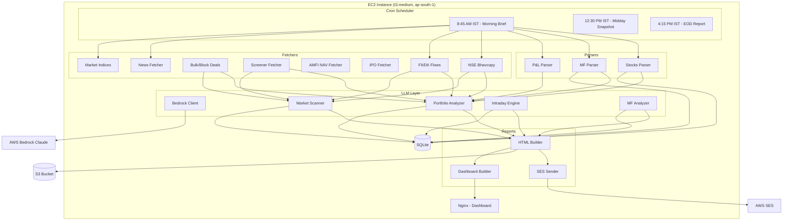
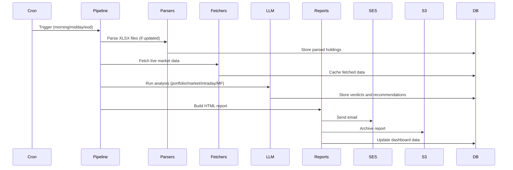
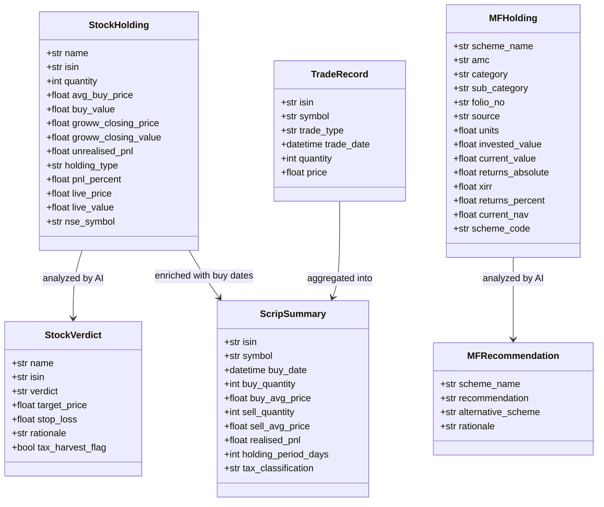

# Design Document: Wealth Builder Pro

## Overview

Wealth Builder Pro is a Python-based personal wealth intelligence platform for Indian retail investors. It runs on an EC2 instance (t3.medium, Ubuntu 22.04, ap-south-1) and orchestrates a pipeline of XLSX parsing, live market data fetching, AI-driven analysis via AWS Bedrock Claude Sonnet, and HTML email report delivery via AWS SES. A static web dashboard served by Nginx provides on-demand access.

The system follows a layered architecture: parsers ingest Groww broker exports, fetchers pull live data from Indian financial sources, an LLM layer performs analysis, and a reports layer generates and delivers HTML emails. SQLite provides persistence, S3 provides durable storage, and cron drives the three daily report cycles at 8:45 AM, 12:30 PM, and 4:15 PM IST on weekdays.

### Key Design Decisions

1. **Python 3.11** — Mature ecosystem for data processing (openpyxl), AWS integration (boto3), and templating (Jinja2).
2. **SQLite over PostgreSQL** — Single-user system with low write concurrency; SQLite eliminates operational overhead.
3. **AWS Bedrock over direct API** — IAM role-based auth, no API key management, stays within AWS network in ap-south-1.
4. **Static dashboard over SPA framework** — Simple HTML/CSS/JS served by Nginx; no build toolchain needed for a single-user dashboard.
5. **Cron over task queues** — Three fixed daily schedules don't warrant Celery/SQS complexity.
6. **YAML config** — Human-readable, supports nested structures for multi-section configuration.

## Architecture

### System Architecture Diagram



### Pipeline Flow

Each cron trigger executes a pipeline script that orchestrates the following sequence:




## Components and Interfaces

### 1. Parsers Layer (`parsers/`)

#### `groww_stocks_parser.py`

```python
@dataclass
class StockHolding:
    name: str
    isin: str
    quantity: int
    avg_buy_price: float
    buy_value: float
    groww_closing_price: float
    groww_closing_value: float
    unrealised_pnl: float
    holding_type: str  # "stock", "etf", "invit"
    pnl_percent: float
    live_price: float | None = None
    live_value: float | None = None
    nse_symbol: str | None = None

def parse_stocks_xlsx(file_path: str) -> list[StockHolding]:
    """Parse Groww Stocks Holdings XLSX. Header at row 11, data from row 12. Columns B-I."""
    ...

def classify_holding(isin: str, name: str, invit_isins: set[str]) -> str:
    """Classify as 'stock', 'etf', or 'invit' based on ISIN prefix and name patterns."""
    ...
```

#### `groww_mf_parser.py`

```python
@dataclass
class MFHolding:
    scheme_name: str
    amc: str
    category: str
    sub_category: str
    folio_no: str
    source: str
    units: float
    invested_value: float
    current_value: float
    returns_absolute: float
    xirr: float
    returns_percent: float
    current_nav: float | None = None
    scheme_code: str | None = None

def parse_mf_xlsx(file_path: str) -> list[MFHolding]:
    """Parse Groww Mutual Funds XLSX. Header at row 23, data from row 24. Columns B-L."""
    ...
```

#### `groww_pnl_parser.py`

```python
@dataclass
class TradeRecord:
    isin: str
    symbol: str
    trade_type: str  # "buy" or "sell"
    trade_date: datetime
    quantity: int
    price: float

@dataclass
class ScripSummary:
    isin: str
    symbol: str
    buy_date: datetime
    buy_quantity: int
    buy_avg_price: float
    sell_quantity: int
    sell_avg_price: float
    realised_pnl: float
    holding_period_days: int
    tax_classification: str  # "short_term" or "long_term"

def parse_pnl_xlsx(file_path: str) -> tuple[list[TradeRecord], list[ScripSummary]]:
    """Parse Groww P&L Report XLSX. Reads both Trade Level and Scrip Level sheets."""
    ...

def compute_holding_period(buy_date: datetime, current_date: datetime) -> int:
    """Return holding period in days."""
    ...

def classify_tax_term(holding_period_days: int, security_type: str) -> str:
    """Classify as 'short_term' or 'long_term'. Stocks/equity MF: 12 months. Debt MF: 36 months."""
    ...
```

### 2. Fetchers Layer (`fetchers/`)

#### `nse_bhavcopy.py`

```python
@dataclass
class BhavcopyRecord:
    isin: str
    symbol: str
    close_price: float
    date: str

def fetch_bhavcopy() -> dict[str, BhavcopyRecord]:
    """Download and parse latest NSE Bhavcopy CSV. Returns dict keyed by ISIN."""
    ...

def get_cached_bhavcopy(cache_dir: str) -> dict[str, BhavcopyRecord] | None:
    """Load most recent cached Bhavcopy if available."""
    ...
```

#### `nse_fii_dii.py`

```python
@dataclass
class FIIDIIFlow:
    date: str
    fii_buy: float
    fii_sell: float
    fii_net: float
    dii_buy: float
    dii_sell: float
    dii_net: float

def fetch_fii_dii() -> FIIDIIFlow:
    """Fetch latest FII/DII flow data from NSE API."""
    ...
```

#### `nse_bulk_deals.py`

```python
@dataclass
class DealRecord:
    deal_type: str  # "bulk" or "block"
    security_name: str
    isin: str
    client_name: str
    quantity: int
    price: float

def fetch_bulk_deals() -> list[DealRecord]:
    """Fetch latest bulk and block deals from NSE."""
    ...
```

#### `screener_fetcher.py`

```python
@dataclass
class StockFundamentals:
    symbol: str
    pe_ratio: float | None
    market_cap: float | None
    book_value: float | None
    dividend_yield: float | None
    roce: float | None
    promoter_holding: float | None

def fetch_fundamentals(symbol: str) -> StockFundamentals:
    """Fetch stock fundamentals from Screener.in public page. Rate limited to 1 req/sec."""
    ...
```

#### `amfi_nav_fetcher.py`

```python
@dataclass
class NAVRecord:
    scheme_code: str
    scheme_name: str
    nav: float
    date: str

def fetch_amfi_nav() -> dict[str, NAVRecord]:
    """Download and parse AMFI NAV data. Returns dict keyed by scheme code."""
    ...
```

#### `ipo_fetcher.py`

```python
@dataclass
class IPORecord:
    name: str
    price_band: str
    gmp: float
    estimated_listing_price: float
    subscription_status: str

def fetch_ipo_gmp() -> list[IPORecord]:
    """Fetch IPO GMP data from Chittorgarh."""
    ...
```

#### `news_fetcher.py`

```python
@dataclass
class NewsItem:
    headline: str
    pub_date: datetime
    source: str
    summary: str

def fetch_news() -> list[NewsItem]:
    """Fetch news from ET RSS and BSE announcements. Filters to last 24 hours."""
    ...
```

#### `market_indices.py`

```python
@dataclass
class IndexData:
    name: str
    last_price: float
    change: float
    change_percent: float

def fetch_indices() -> list[IndexData]:
    """Fetch Nifty 50, Sensex, Nifty Bank, Nifty Midcap 100 from NSE."""
    ...
```

### 3. LLM Layer (`llm/`)

#### `bedrock_client.py`

```python
class BedrockClient:
    def __init__(self, region: str, model_id: str):
        """Initialize boto3 Bedrock runtime client."""
        ...

    def invoke(self, system_prompt: str, user_prompt: str) -> dict:
        """Send prompt to Claude Sonnet via Bedrock. Returns parsed JSON response."""
        ...
```

#### `portfolio_analyzer.py`

```python
@dataclass
class StockVerdict:
    name: str
    isin: str
    verdict: str  # "buy", "hold", "sell", "exit"
    target_price: float
    stop_loss: float
    rationale: str
    tax_harvest_flag: bool

def analyze_portfolio(
    holdings: list[StockHolding],
    bhavcopy: dict[str, BhavcopyRecord],
    fundamentals: dict[str, StockFundamentals],
    pnl_data: list[ScripSummary],
    client: BedrockClient
) -> list[StockVerdict]:
    """Generate AI verdicts for each stock holding."""
    ...
```

#### `market_scanner.py`

```python
@dataclass
class MarketOpportunity:
    stock_name: str
    signal_type: str  # "promoter_buying", "multibagger", "fii_accumulation"
    rationale: str

def scan_opportunities(
    deals: list[DealRecord],
    fii_dii: FIIDIIFlow,
    fundamentals: dict[str, StockFundamentals],
    client: BedrockClient
) -> list[MarketOpportunity]:
    """Identify market opportunities from deal data and institutional flows."""
    ...
```

#### `intraday_engine.py`

```python
@dataclass
class IntradaySetup:
    stock_name: str
    entry_price: float
    target_price: float
    stop_loss: float
    rationale: str

def generate_intraday_setups(
    market_data: dict,
    client: BedrockClient
) -> list[IntradaySetup]:
    """Generate exactly 5 intraday trading setups."""
    ...
```

#### `mf_analyzer.py`

```python
@dataclass
class MFRecommendation:
    scheme_name: str
    recommendation: str  # "continue", "stop", "switch"
    alternative_scheme: str | None
    rationale: str

def analyze_mutual_funds(
    holdings: list[MFHolding],
    nav_data: dict[str, NAVRecord],
    client: BedrockClient
) -> list[MFRecommendation]:
    """Generate SIP recommendations for each mutual fund scheme."""
    ...
```

### 4. Reports Layer (`reports/`)

#### `html_builder.py`

```python
def build_morning_brief(context: dict) -> str:
    """Render morning brief HTML using Jinja2 template."""
    ...

def build_midday_snapshot(context: dict) -> str:
    """Render midday snapshot HTML using Jinja2 template."""
    ...

def build_eod_report(context: dict) -> str:
    """Render EOD full report HTML using Jinja2 template."""
    ...
```

#### `ses_sender.py`

```python
def send_email(html_body: str, subject: str, sender: str, recipient: str, region: str) -> bool:
    """Send HTML email via SES using boto3. Retries up to 3 times with exponential backoff."""
    ...
```

#### `dashboard_builder.py`

```python
def build_dashboard(context: dict, output_dir: str) -> None:
    """Generate static HTML dashboard files for Nginx serving."""
    ...
```

### 5. Database Layer (`database/`)

#### `db_manager.py`

```python
class DBManager:
    def __init__(self, db_path: str):
        """Initialize SQLite connection and create tables if needed."""
        ...

    def store_holdings(self, holdings: list[StockHolding], timestamp: datetime) -> None: ...
    def store_mf_holdings(self, holdings: list[MFHolding], timestamp: datetime) -> None: ...
    def store_verdicts(self, verdicts: list[StockVerdict], timestamp: datetime) -> None: ...
    def store_mf_recommendations(self, recs: list[MFRecommendation], timestamp: datetime) -> None: ...
    def get_holdings_at(self, date: datetime) -> list[StockHolding]: ...
    def get_latest_verdicts(self) -> list[StockVerdict]: ...
```

### 6. Configuration (`config/`)

#### `config.yaml` structure

```yaml
aws:
  region: ap-south-1
  s3_bucket: wealth-builder-pro-reports
  ses_sender: "[email]"
  ses_recipient: "[email]"
  bedrock_model_id: anthropic.claude-3-sonnet-20240229-v1:0

portfolio:
  stocks_xlsx: /path/to/stocks.xlsx
  mf_xlsx: /path/to/mf.xlsx
  pnl_xlsx: /path/to/pnl.xlsx
  invit_isins:
    - INE0XXXXX000

schedule:
  morning_brief: "03:15"   # UTC for 8:45 AM IST
  midday_snapshot: "07:00"  # UTC for 12:30 PM IST
  eod_report: "10:45"      # UTC for 4:15 PM IST

database:
  path: /opt/wealth-builder-pro/data/portfolio.db

cache:
  dir: /opt/wealth-builder-pro/cache

dashboard:
  output_dir: /var/www/wealth-builder-pro
```

#### `config_loader.py`

```python
@dataclass
class AppConfig:
    aws_region: str
    s3_bucket: str
    ses_sender: str
    ses_recipient: str
    bedrock_model_id: str
    stocks_xlsx: str
    mf_xlsx: str
    pnl_xlsx: str
    invit_isins: list[str]
    db_path: str
    cache_dir: str
    dashboard_output_dir: str

def load_config(config_path: str) -> AppConfig:
    """Load and validate YAML config. Raises ValueError for missing required keys."""
    ...
```

### 7. Scripts Layer (`scripts/`)

```python
# run_morning_brief.py — Triggered by cron at 8:45 AM IST
# run_midday_snapshot.py — Triggered by cron at 12:30 PM IST
# run_eod_report.py — Triggered by cron at 4:15 PM IST
# deploy.sh — EC2 setup, Nginx config, cron installation
```

## Data Models

### SQLite Schema

```sql
CREATE TABLE IF NOT EXISTS stock_holdings (
    id INTEGER PRIMARY KEY AUTOINCREMENT,
    timestamp TEXT NOT NULL,  -- ISO 8601 in IST
    name TEXT NOT NULL,
    isin TEXT NOT NULL,
    quantity INTEGER NOT NULL,
    avg_buy_price REAL NOT NULL,
    buy_value REAL NOT NULL,
    closing_price REAL NOT NULL,
    closing_value REAL NOT NULL,
    unrealised_pnl REAL NOT NULL,
    holding_type TEXT NOT NULL,  -- 'stock', 'etf', 'invit'
    pnl_percent REAL NOT NULL,
    live_price REAL,
    live_value REAL,
    nse_symbol TEXT
);

CREATE TABLE IF NOT EXISTS mf_holdings (
    id INTEGER PRIMARY KEY AUTOINCREMENT,
    timestamp TEXT NOT NULL,
    scheme_name TEXT NOT NULL,
    amc TEXT NOT NULL,
    category TEXT NOT NULL,
    sub_category TEXT NOT NULL,
    folio_no TEXT NOT NULL,
    source TEXT NOT NULL,
    units REAL NOT NULL,
    invested_value REAL NOT NULL,
    current_value REAL NOT NULL,
    returns_absolute REAL NOT NULL,
    xirr REAL NOT NULL,
    returns_percent REAL NOT NULL,
    current_nav REAL,
    scheme_code TEXT
);

CREATE TABLE IF NOT EXISTS stock_verdicts (
    id INTEGER PRIMARY KEY AUTOINCREMENT,
    timestamp TEXT NOT NULL,
    name TEXT NOT NULL,
    isin TEXT NOT NULL,
    verdict TEXT NOT NULL,  -- 'buy', 'hold', 'sell', 'exit'
    target_price REAL NOT NULL,
    stop_loss REAL NOT NULL,
    rationale TEXT NOT NULL,
    tax_harvest_flag INTEGER NOT NULL DEFAULT 0
);

CREATE TABLE IF NOT EXISTS mf_recommendations (
    id INTEGER PRIMARY KEY AUTOINCREMENT,
    timestamp TEXT NOT NULL,
    scheme_name TEXT NOT NULL,
    recommendation TEXT NOT NULL,  -- 'continue', 'stop', 'switch'
    alternative_scheme TEXT,
    rationale TEXT NOT NULL
);

CREATE TABLE IF NOT EXISTS trade_records (
    id INTEGER PRIMARY KEY AUTOINCREMENT,
    timestamp TEXT NOT NULL,
    isin TEXT NOT NULL,
    symbol TEXT NOT NULL,
    trade_type TEXT NOT NULL,
    trade_date TEXT NOT NULL,
    quantity INTEGER NOT NULL,
    price REAL NOT NULL
);

CREATE TABLE IF NOT EXISTS bhavcopy_cache (
    id INTEGER PRIMARY KEY AUTOINCREMENT,
    date TEXT NOT NULL UNIQUE,
    data_json TEXT NOT NULL
);

CREATE TABLE IF NOT EXISTS fii_dii_cache (
    id INTEGER PRIMARY KEY AUTOINCREMENT,
    date TEXT NOT NULL UNIQUE,
    data_json TEXT NOT NULL
);
```

### Dataclass Relationships



## Correctness Properties

*A property is a characteristic or behavior that should hold true across all valid executions of a system — essentially, a formal statement about what the system should do. Properties serve as the bridge between human-readable specifications and machine-verifiable correctness guarantees.*

### Property 1: StockHolding JSON round-trip

*For any* valid list of `StockHolding` objects, serializing to JSON and then deserializing back should produce an equivalent list of `StockHolding` objects with all fields preserved.

**Validates: Requirements 1.8**

### Property 2: MFHolding JSON round-trip

*For any* valid list of `MFHolding` objects, serializing to JSON and then deserializing back should produce an equivalent list of `MFHolding` objects with all fields preserved.

**Validates: Requirements 2.6**

### Property 3: P&L data JSON round-trip

*For any* valid list of `TradeRecord` and `ScripSummary` objects, serializing to JSON and then deserializing back should produce equivalent objects with all fields preserved.

**Validates: Requirements 3.6**

### Property 4: Holding classification correctness and exclusivity

*For any* ISIN string and holding name, the `classify_holding` function should return exactly one of `"stock"`, `"etf"`, or `"invit"`. Specifically: ISINs starting with `"INE"` that are not in the InvIT list should classify as `"stock"`, ISINs starting with `"INF"` should classify as `"etf"`, names containing any of `"ETF"`, `"BEES"`, `"NASDAQ"`, `"MAFANG"`, `"MAHKTECH"`, `"SILVER"` should classify as `"etf"` regardless of ISIN prefix, and ISINs in the known InvIT list should classify as `"invit"`.

**Validates: Requirements 1.3, 1.4, 22.1, 22.2, 22.3, 22.4, 22.5**

### Property 5: Stock column extraction completeness

*For any* valid row of stock data (with all required columns present at the expected positions), the `parse_stocks_xlsx` function should produce a `StockHolding` object containing all 8 required fields: name, isin, quantity, avg_buy_price, buy_value, groww_closing_price, groww_closing_value, unrealised_pnl.

**Validates: Requirements 1.2**

### Property 6: MF column extraction completeness

*For any* valid row of mutual fund data (with all required columns present at the expected positions), the `parse_mf_xlsx` function should produce an `MFHolding` object containing all 11 required fields: scheme_name, amc, category, sub_category, folio_no, source, units, invested_value, current_value, returns_absolute, xirr.

**Validates: Requirements 2.2**

### Property 7: Trade record extraction

*For any* valid trade-level row in a P&L XLSX, the parser should extract a `TradeRecord` with a valid buy date (parseable datetime) and a non-empty ISIN string.

**Validates: Requirements 3.2**

### Property 8: Holding period computation

*For any* two dates where `buy_date <= current_date`, `compute_holding_period(buy_date, current_date)` should return a non-negative integer equal to the number of days between the two dates.

**Validates: Requirements 3.3**

### Property 9: Tax term classification

*For any* holding period in days and security type, `classify_tax_term` should return `"short_term"` when the holding period is below the threshold (365 days for stocks/equity MF, 1095 days for debt MF) and `"long_term"` when at or above the threshold.

**Validates: Requirements 3.4**

### Property 10: Bhavcopy CSV parsing

*For any* valid Bhavcopy CSV content with rows containing ISIN and closing price columns, parsing should produce a dictionary keyed by ISIN where each value contains a valid closing price (positive float).

**Validates: Requirements 4.2**

### Property 11: FII/DII response parsing

*For any* valid FII/DII API response JSON containing buy/sell values for FII and DII, parsing should produce a `FIIDIIFlow` object where `fii_net == fii_buy - fii_sell` and `dii_net == dii_buy - dii_sell`.

**Validates: Requirements 5.2**

### Property 12: Deal record parsing

*For any* valid bulk/block deal data, parsing should produce `DealRecord` objects each containing all 6 required fields: deal_type (one of "bulk" or "block"), security_name, isin, client_name, quantity (positive int), and price (positive float).

**Validates: Requirements 6.2**

### Property 13: Screener fundamentals extraction

*For any* valid Screener.in HTML page containing the expected data structure, the parser should extract a `StockFundamentals` object with at least one non-None metric among pe_ratio, market_cap, book_value, dividend_yield, roce, and promoter_holding.

**Validates: Requirements 7.2**

### Property 14: AMFI NAV lookup

*For any* valid AMFI NAV text data containing scheme entries, parsing should produce a dictionary where looking up any scheme code present in the input returns a `NAVRecord` with a positive NAV value.

**Validates: Requirements 8.2**

### Property 15: IPO record extraction

*For any* valid IPO HTML page containing IPO entries, parsing should produce `IPORecord` objects each containing all 5 required fields: name (non-empty), price_band (non-empty), gmp, estimated_listing_price, and subscription_status (non-empty).

**Validates: Requirements 9.2**

### Property 16: News item extraction and filtering

*For any* valid RSS XML feed containing news entries with publication dates, parsing should produce `NewsItem` objects each containing headline, pub_date, source, and summary. Furthermore, *for any* list of `NewsItem` objects, filtering by a reference time should retain only items where `pub_date` is within 24 hours before the reference time.

**Validates: Requirements 10.2, 10.3**

### Property 17: Stock verdict output structure

*For any* AI analysis response for stock holdings, each `StockVerdict` should contain a verdict that is exactly one of `"buy"`, `"hold"`, `"sell"`, or `"exit"`, a positive `target_price`, and a positive `stop_loss` where `stop_loss < target_price`.

**Validates: Requirements 11.2, 11.3**

### Property 18: Tax loss harvesting flag

*For any* stock holding with negative unrealised P&L and a holding period from the P&L parser, the tax harvest flag logic should mark it as a tax loss harvesting candidate when the holding is in a short-term period.

**Validates: Requirements 11.4**

### Property 19: Intraday setup output structure

*For any* AI analysis response for intraday setups, the output should contain exactly 5 `IntradaySetup` objects, each with a positive `entry_price`, a `target_price > entry_price`, a `stop_loss < entry_price`, and a non-empty `rationale` string.

**Validates: Requirements 13.1, 13.2, 13.3**

### Property 20: MF recommendation output structure

*For any* AI analysis response for mutual fund schemes, each `MFRecommendation` should contain a recommendation that is exactly one of `"continue"`, `"stop"`, or `"switch"`. When the recommendation is `"switch"`, the `alternative_scheme` field must be non-None and non-empty.

**Validates: Requirements 14.2, 14.3**

### Property 21: Morning brief report content

*For any* valid report context containing portfolio data, market changes, FII/DII flows, and news items, the rendered morning brief HTML should contain text or elements representing each of these four sections.

**Validates: Requirements 15.2**

### Property 22: Midday report content

*For any* valid report context containing intraday setups, portfolio performance, and deal alerts, the rendered midday HTML should contain text or elements representing each of these three sections.

**Validates: Requirements 16.2**

### Property 23: EOD report content

*For any* valid report context containing portfolio verdicts, day P&L, MF analysis, tax harvesting data, and IPO GMP data, the rendered EOD HTML should contain text or elements representing each of these five sections.

**Validates: Requirements 17.2**

### Property 24: SES retry behavior

*For any* sequence of SES send failures, the `send_email` function should retry up to 3 times before giving up, and the total number of attempts should never exceed 4 (1 initial + 3 retries).

**Validates: Requirements 15.5, 16.5, 17.5**

### Property 25: Dashboard content completeness

*For any* valid dashboard context containing portfolio summary, stock verdicts, MF recommendations, and FII/DII flow data, the generated dashboard HTML should contain text or elements representing all four sections: total invested value, current value, overall P&L, verdict indicators, SIP recommendations, and FII/DII data.

**Validates: Requirements 18.1, 18.2, 18.3, 18.4**

### Property 26: Database holdings round-trip

*For any* list of `StockHolding` or `MFHolding` objects and a timestamp, storing them in the database and then querying by that timestamp should return equivalent objects.

**Validates: Requirements 19.1, 19.2**

### Property 27: Database historical query

*For any* sequence of holdings stored at different timestamps t1 < t2 < t3, querying at timestamp t2 should return the holdings stored at t2, not those from t1 or t3.

**Validates: Requirements 19.3**

### Property 28: IST to UTC cron conversion

*For any* IST time, converting to UTC by subtracting 5 hours 30 minutes should produce the correct UTC time for cron scheduling. Specifically, 8:45 AM IST = 3:15 AM UTC, 12:30 PM IST = 7:00 AM UTC, 4:15 PM IST = 10:45 AM UTC.

**Validates: Requirements 21.4**

### Property 29: Configuration loading completeness

*For any* valid YAML configuration file containing all required keys (aws.region, aws.s3_bucket, aws.ses_sender, aws.ses_recipient, aws.bedrock_model_id, portfolio.stocks_xlsx, portfolio.mf_xlsx, portfolio.pnl_xlsx, schedule times, database.path), loading should produce an `AppConfig` with all fields populated and non-empty.

**Validates: Requirements 24.1, 24.2, 24.3**

### Property 30: Configuration missing key error

*For any* YAML configuration file missing at least one required key, `load_config` should raise a `ValueError` whose message contains the name of the missing key.

**Validates: Requirements 24.4**

### Property 31: Market index data parsing

*For any* valid index data API response containing entries for market indices, parsing should produce `IndexData` objects each containing a non-empty name, a positive last_price, and numeric change and change_percent values.

**Validates: Requirements 23.2**

## Error Handling

### Strategy

The system uses a **fail-soft** approach: individual component failures should not halt the entire pipeline. Each layer has specific error handling patterns.

### Parsers

| Error Condition | Handling |
|---|---|
| XLSX file not found | Raise `FileNotFoundError` with file path. Pipeline aborts for this cycle. |
| Wrong header structure (row 11/23) | Raise `ValueError` with descriptive message identifying expected vs actual headers. |
| Malformed data row | Log warning with row number and column details. Skip row, continue parsing remaining rows. |
| Missing required column value | Log warning with row number and column name. Skip row. |
| openpyxl read failure | Raise `RuntimeError` wrapping the underlying exception. |

### Fetchers

| Error Condition | Handling |
|---|---|
| Network timeout / connection error | Log error. Return cached data if available, otherwise return empty result. |
| HTTP 4xx/5xx response | Log error with status code and URL. Return cached data or empty result. |
| Malformed response body | Log error with response snippet. Return empty result. |
| Rate limit exceeded (Screener.in) | Implement 1 req/sec rate limiter via `time.sleep()`. Retry after backoff on 429. |
| RSS parse failure | Log error. Continue with other available feeds. |

### LLM Layer

| Error Condition | Handling |
|---|---|
| Bedrock API timeout | Log error. Mark analysis as unavailable. Pipeline continues without AI section. |
| Bedrock throttling | Retry with exponential backoff (max 3 retries). |
| Invalid JSON in LLM response | Log error with raw response. Mark analysis as unavailable. |
| LLM returns fewer/more items than expected | Log warning. Use available items, pad missing with "unavailable" markers. |

### Reports

| Error Condition | Handling |
|---|---|
| Jinja2 template rendering error | Log error. Skip report generation for this cycle. |
| SES send failure | Retry up to 3 times with exponential backoff (1s, 2s, 4s). Log each attempt. |
| S3 upload failure | Log error. Continue with email delivery — S3 archival is non-blocking. |

### Database

| Error Condition | Handling |
|---|---|
| SQLite write failure | Log error with table name and operation. Continue pipeline without halting. |
| SQLite read failure | Log error. Return empty result set. |
| Database file corruption | Log critical error. Attempt to recreate tables on next run. |

### Configuration

| Error Condition | Handling |
|---|---|
| Config file not found | Raise `FileNotFoundError` at startup. Application does not start. |
| Missing required config key | Raise `ValueError` naming the missing key at startup. Application does not start. |
| Invalid config value type | Raise `ValueError` with key name and expected type at startup. |

### Logging

All components use Python's `logging` module with the following configuration:
- Log level: `INFO` for normal operations, `WARNING` for skipped rows/fallbacks, `ERROR` for failures
- Log format: `%(asctime)s [%(levelname)s] %(name)s: %(message)s`
- Log output: File (`/opt/wealth-builder-pro/logs/app.log`) with daily rotation
- Timestamps in IST

## Testing Strategy

### Testing Framework

- **Unit/Integration tests**: `pytest`
- **Property-based tests**: `hypothesis` (Python PBT library)
- **Mocking**: `unittest.mock` for AWS services (Bedrock, SES, S3) and network calls

### Dual Testing Approach

Both unit tests and property-based tests are required for comprehensive coverage:

- **Unit tests** verify specific examples, edge cases, and error conditions
- **Property tests** verify universal properties across randomly generated inputs
- Together they provide complementary coverage: unit tests catch concrete bugs, property tests verify general correctness

### Property-Based Testing Configuration

- Library: `hypothesis` (https://hypothesis.readthedocs.io/)
- Minimum iterations: 100 per property test (`@settings(max_examples=100)`)
- Each property test must reference its design document property with a comment tag
- Tag format: `# Feature: wealth-builder-pro, Property {number}: {property_text}`
- Each correctness property must be implemented by a single property-based test

### Test Organization

```
tests/
├── unit/
│   ├── test_stocks_parser.py       # Example-based tests for stocks parsing
│   ├── test_mf_parser.py           # Example-based tests for MF parsing
│   ├── test_pnl_parser.py          # Example-based tests for P&L parsing
│   ├── test_classify_holding.py    # Example-based tests for classification
│   ├── test_fetcher_parsers.py     # Example-based tests for fetcher response parsing
│   ├── test_html_builder.py        # Example-based tests for report rendering
│   ├── test_ses_sender.py          # Example-based tests for email sending
│   ├── test_db_manager.py          # Example-based tests for DB operations
│   └── test_config_loader.py       # Example-based tests for config loading
├── property/
│   ├── test_roundtrip_props.py     # Properties 1-3: JSON round-trip for all dataclasses
│   ├── test_classification_props.py # Property 4: Holding classification
│   ├── test_parser_props.py        # Properties 5-9: Parser extraction and computation
│   ├── test_fetcher_props.py       # Properties 10-16: Fetcher response parsing
│   ├── test_ai_output_props.py     # Properties 17-20: AI output structure validation
│   ├── test_report_props.py        # Properties 21-25: Report and dashboard content
│   ├── test_db_props.py            # Properties 26-27: Database round-trip and history
│   ├── test_schedule_props.py      # Property 28: IST/UTC conversion
│   ├── test_config_props.py        # Properties 29-30: Config loading
│   └── test_index_props.py         # Property 31: Market index parsing
└── conftest.py                     # Shared fixtures and Hypothesis strategies
```

### Hypothesis Custom Strategies

Custom `hypothesis` strategies will be needed for generating:
- Valid `StockHolding`, `MFHolding`, `TradeRecord`, `ScripSummary` dataclass instances
- Valid ISIN strings (12-char alphanumeric starting with INE/INF)
- Valid XLSX-like row data structures
- Valid CSV/JSON/XML response bodies for fetcher tests
- Valid YAML config dictionaries with required/optional keys
- Valid HTML template context dictionaries

### Unit Test Focus Areas

- **Specific examples**: Known Groww XLSX structures, known NSE response formats
- **Edge cases**: Empty files, single-row files, malformed headers, missing columns, Unicode in stock names
- **Error conditions**: Network failures (mocked), invalid API responses, missing config keys, DB write failures
- **Integration points**: Pipeline orchestration, cron trigger → pipeline → report → email flow (mocked)

### Mocking Strategy

- AWS Bedrock: Mock `boto3.client('bedrock-runtime')` to return predefined JSON responses
- AWS SES: Mock `boto3.client('ses')` to verify email parameters and simulate failures
- AWS S3: Mock `boto3.client('s3')` to verify upload parameters
- Network calls: Mock `requests.get` / `urllib.request.urlopen` for all fetcher tests
- File system: Use `tmp_path` pytest fixture for XLSX file creation in tests
- SQLite: Use in-memory SQLite (`":memory:"`) for database tests
